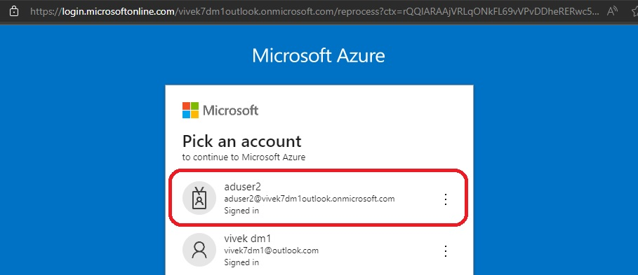
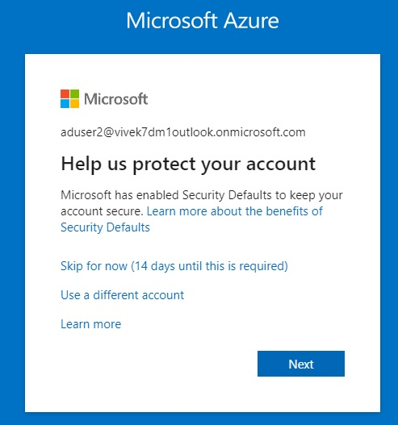
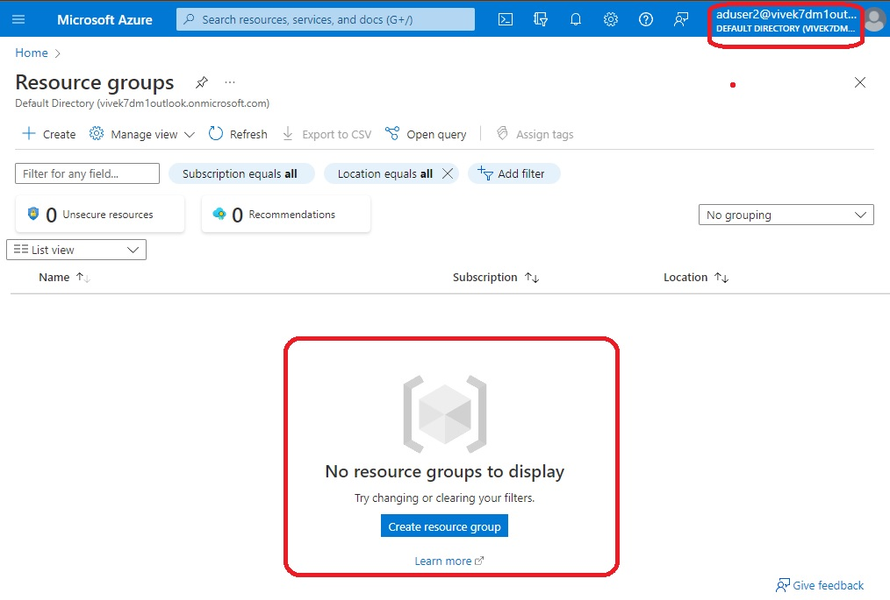
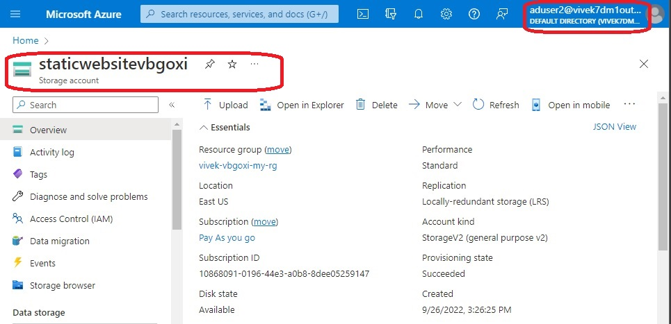
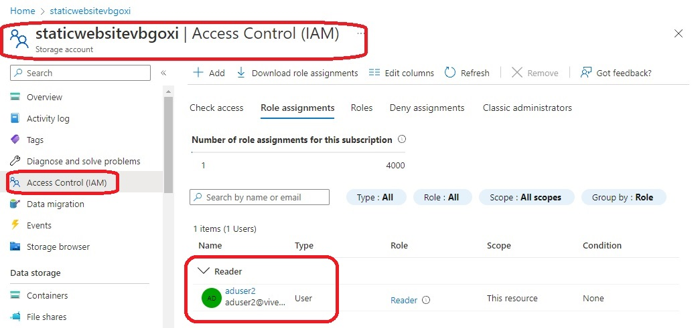

# Creates a user, and then assigns it a Reader role.

- Reader role is a generic role 

- A similar example is [repeated here in this same repository](https://github.com/AvtsVivek/Az204WthTerraform/tree/main/src/tf-files/860175-storage-access-with-azure-active-dir). 

- So the newly created user has access to readonly access to Azure Storage Account(any resource for that matter)

