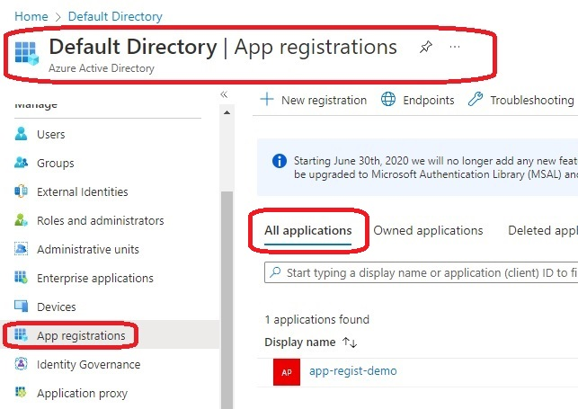
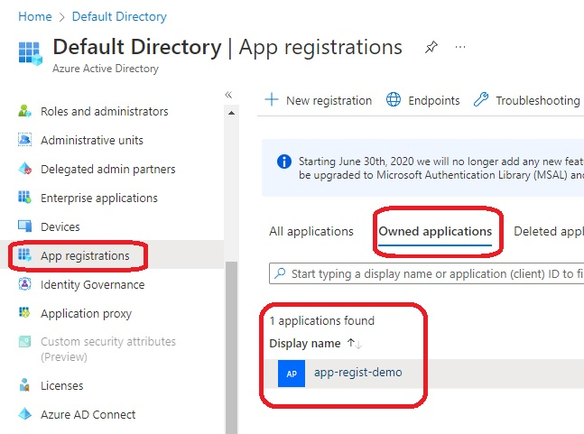
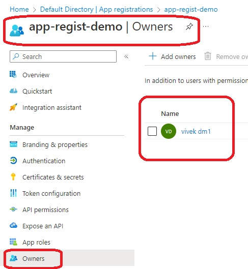

# Terraform-App-Rrgistration-Azure-AD

- This is same as the previous example. This adds a owner

```
data "azuread_client_config" "current" {}

resource "azuread_application" "webdb" {
  display_name = var.appname
  owners       = [data.azuread_client_config.current.object_id]
}
```
- Note the following code in the above snippet.
    owners       =[data.azuread_client_config.current.object_id]

- Now see the images 








