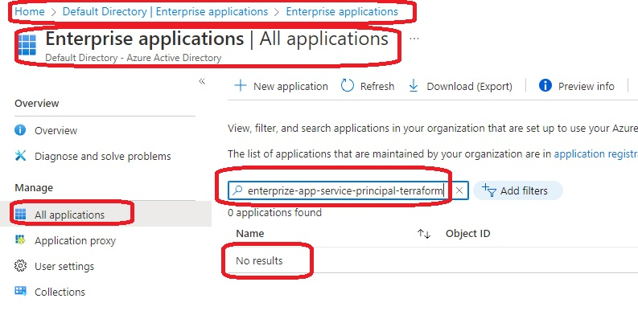

# Terraform-App-Rrgistration-Azure-AD

- See the image 20AppRegistration1.jpg

- 

- Note here that there is no enterprise application created. That is to say there is no Service Principal created.
    - Look at the image 20AppRegistration20.jpg

- 

