# Creating Service Principal using portal.

- Following [this tutorial](https://learn.microsoft.com/en-us/azure/active-directory/develop/howto-create-service-principal-portal). 

- [There is no way to directly create a service principal using the Azure portal](https://learn.microsoft.com/en-us/azure/active-directory/develop/howto-create-service-principal-portal#app-registration-app-objects-and-service-principals).

- To Register an app, you need permissions.
  - Select Azure Active Directory.

  - Find your role under Overview->My feed. If you have the User role, you must make sure that non-administrators can register applications.

  
  - [Check Azure subscription permissions](https://learn.microsoft.com/en-us/azure/active-directory/develop/howto-create-service-principal-portal#check-azure-subscription-permissions). 
  

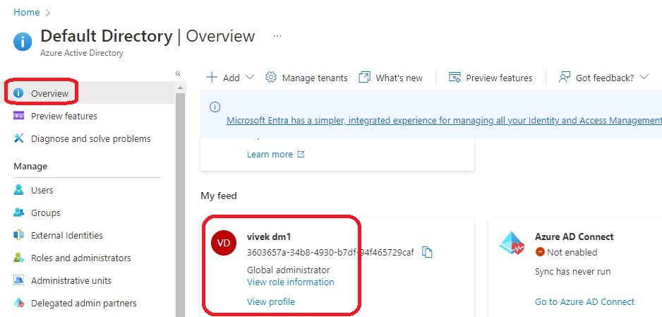

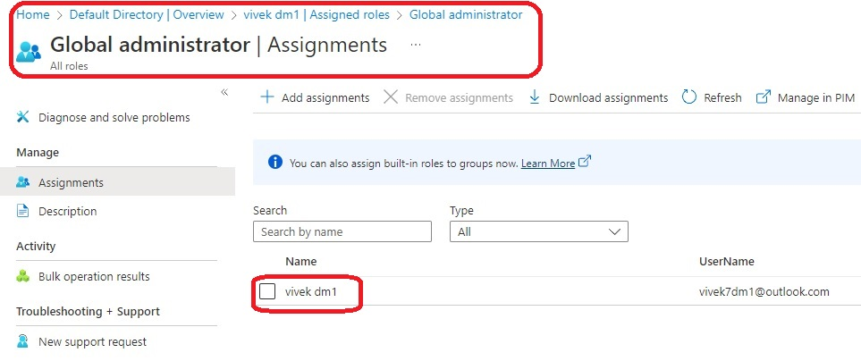

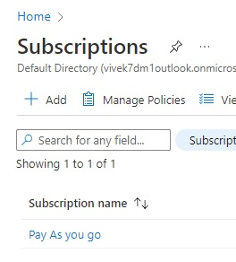
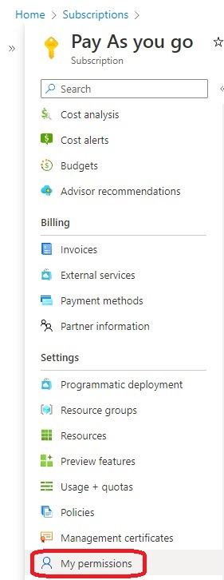
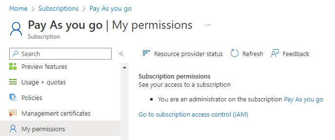
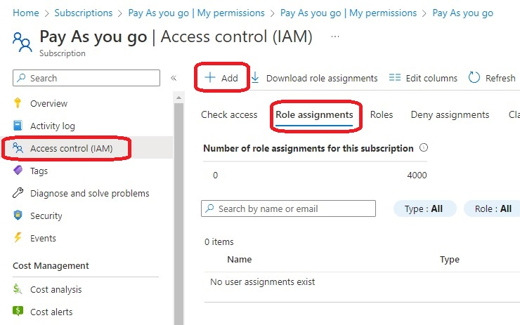
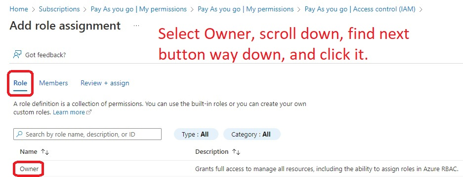
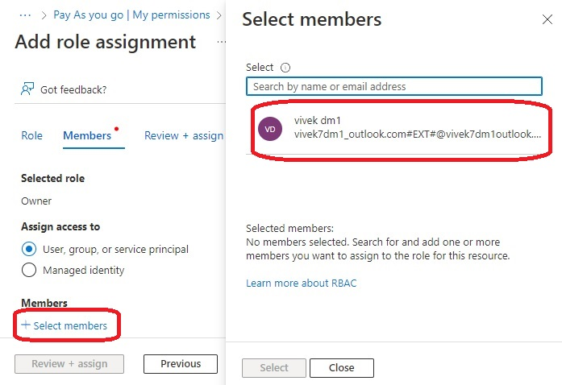
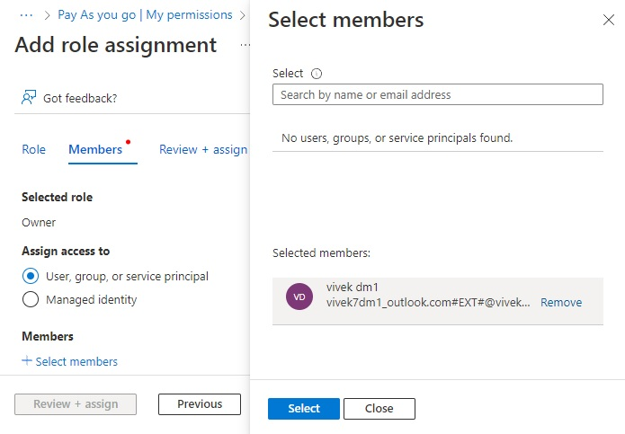
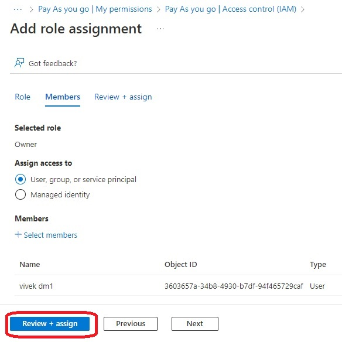
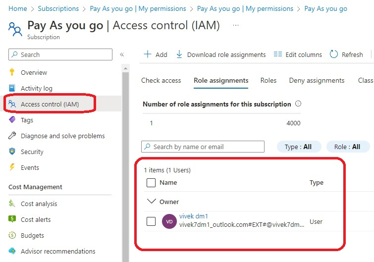

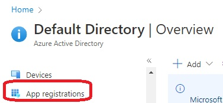
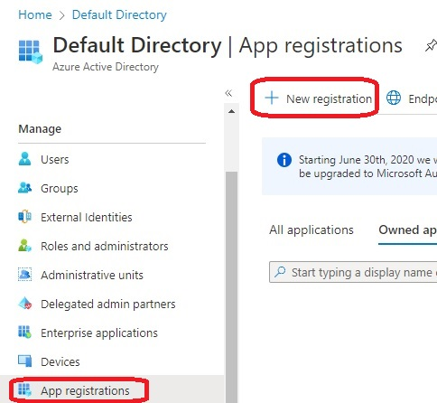
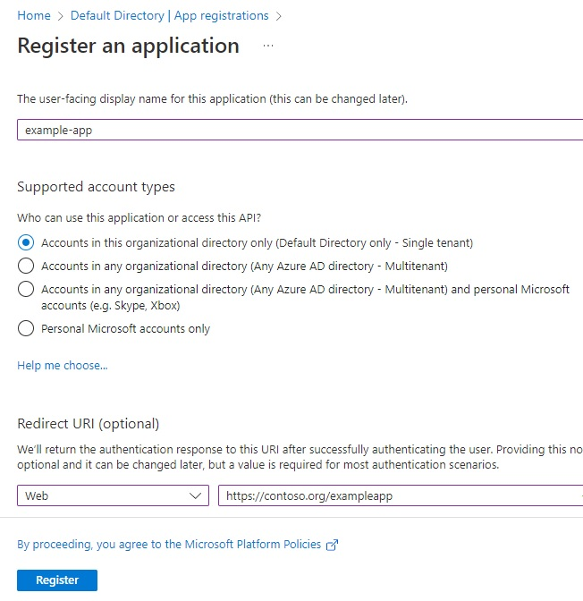
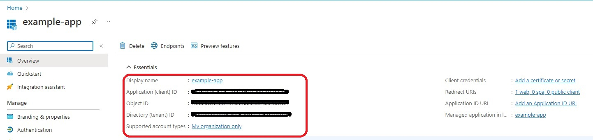

