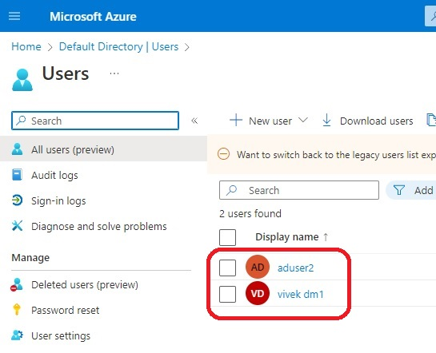
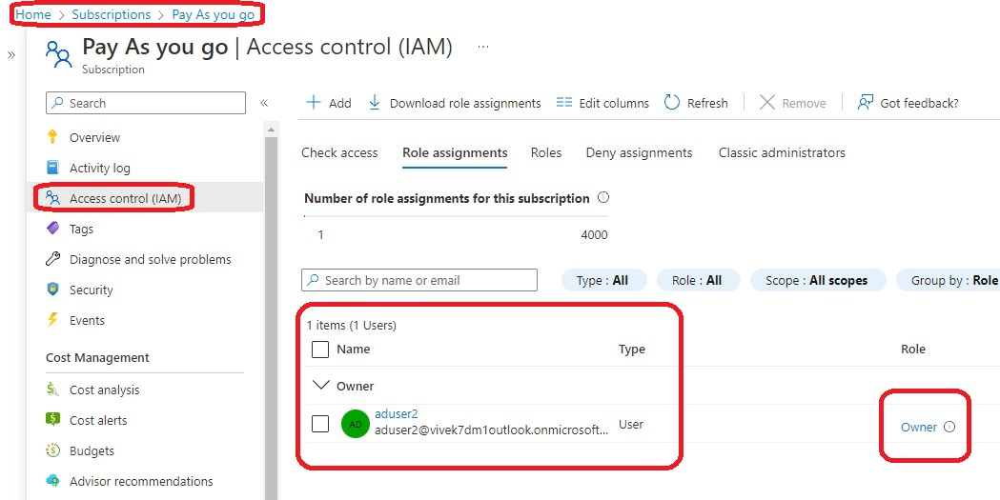

# Objective is to create a new Active Directry user and then add this newly created user as an Owners to the subscription level.

- So this basically demos **azurerm_role_assignment** block.

- 

- 

