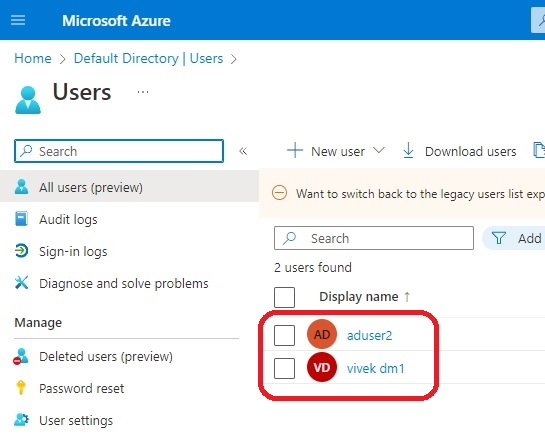
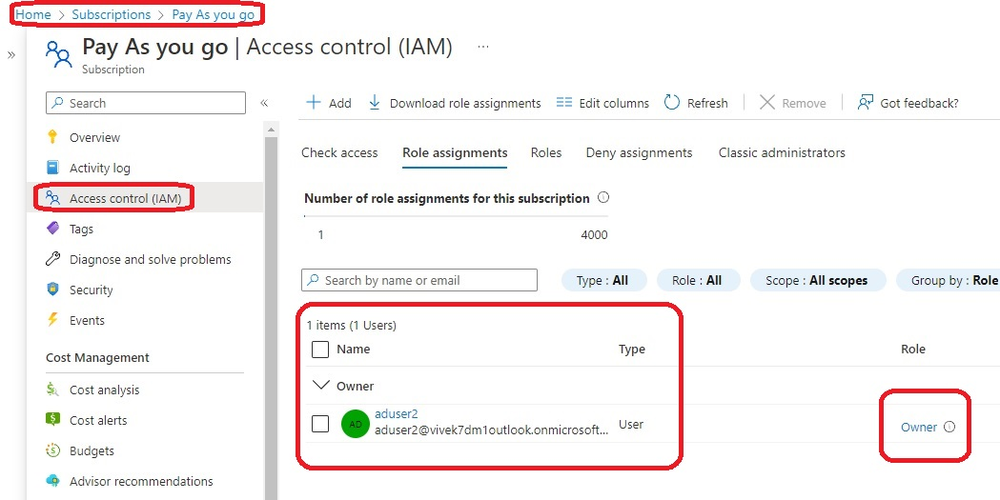

# Objective is to create a new Active Directry user and then add this newly created user as an Owners to the subscription level.

- So this basically demos **azurerm_role_assignment** block.

- Here we are registring an app. Also we are creating a service principal along with this app. 
  - See the config files, tf3-active-directory-app.tf and tf4-service-principal.tf

- The we are assigning a Role of **Owner** to this created Application object/service principal. 
  - The scope for this case being the entire subsctiption.

- 

- 

