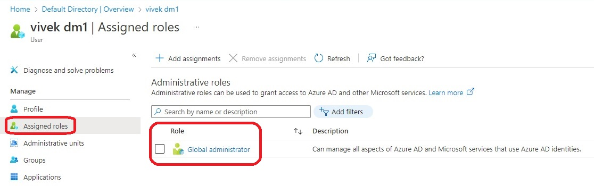

# Objective is to add the current user(principal being used to execute Terraform) as an Owners role at the subscription level.

- Note that this may not make much sense because, the current user(I am the creator of my pay as you go subscription) is already an adminstrator. See the following images. 

- So this basically demos **azurerm_role_assignment** block.

