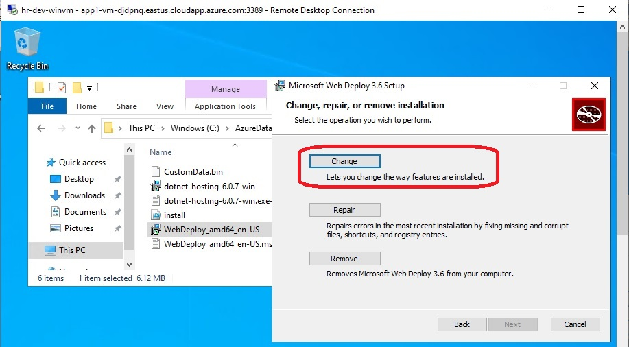

# Add IIS to your Azure VM

- This builds [on the previous example](https://github.com/AvtsVivek/Az204WthTerraform/tree/main/src/500100-simple-web-app-to-azure-vm), and adds iis to the VM.

- Everything is working except that the app is not running on IIS. There is some configuration issue with IIS. See the last screen shots. Leaving at this for now.

- First ensure that the deployment is done. Run the terraform workflow and check on the portal. 

I am getting the following error. Not sure why. I added this time sleep resource as well.

```
resource "time_sleep" "wait_for_some_time" {
  depends_on      = [azurerm_windows_virtual_machine.web_windowsvm]
  create_duration = "60s"
}
```
But still I am getting the error.

```
azurerm_virtual_machine_extension.iis-windows-vm-extension: Creating...
╷
│ Error: compute.VirtualMachineExtensionsClient#CreateOrUpdate: Failure sending request: StatusCode=404 -- Original Error: Code="ParentResourceNotFound" Message="Can not perform requested operation on nested resource. Parent resource 'hr-dev-winvm' not found."
│
│   with azurerm_virtual_machine_extension.iis-windows-vm-extension,
│   on tf7-05-web-windows-vm-resource.tf line 30, in resource "azurerm_virtual_machine_extension" "iis-windows-vm-extension":
│   30: resource "azurerm_virtual_machine_extension" "iis-windows-vm-extension" {
│
╵
```

- OK, so increasing the duration to 360 sec worked. Raised [the issue here](https://github.com/hashicorp/terraform/issues/31755#issuecomment-1240670598).

- Add Azure Account To Vs 2022 


- Add Publish Profile 


- Add Publish Profile 


- Add Publish Profile 


- Add Publish Profile 


- Add Publish Profile 


- If you get an error as shown below, you need to [install web deploy on the developtment machine](https://download.visualstudio.microsoft.com/download/pr/e1828da1-907a-46fe-a3cf-f3b9ea1c485c/035860f3c0d2bab0458e634685648385/webdeploy_amd64_en-us.msi). 

- Add Publish Profile 


- Add Publish Profile 


- Add Publish Profile 


- Web Deploy On Win Server 


- Web Deploy On Win Server 2


- Web Deploy On Win Server 3


- Stuck at this. Not able to resolve this.


- Stuck at this. We are able to see the same from internet.  


- Now this is resolved. The problem is with the dotnet hosting bundle installation. It was not getting installed.
  
- Currently this is resolved with sku = "2019-Datacenter". There seems to be some problem with sku = "2022-Datacenter". Its not working.


