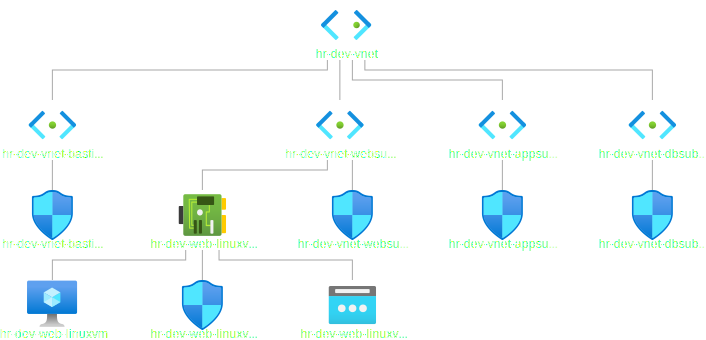

# Create a VM with a network security group

- Web Network Security Group can be considered as the first level.

- VM Network Security Group(Optional) can be considered as the second level.
 
- Port 80 is to connect to app on this VM, and 22 is to connect to the VM.
 
- One VM can be associated with multiple VM Network Interfaces. So the following is a list.
network_interface_ids = [azurerm_network_interface.web_linuxvm_nic.id]

- The following is the diagram downloaded from the Azure Portal.

