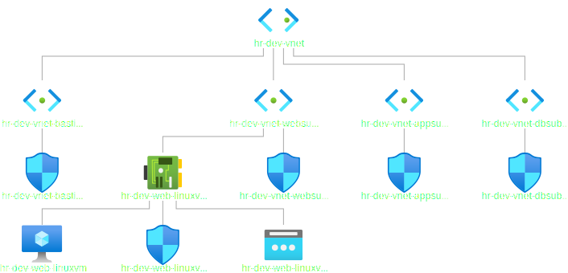

# Create a VM with a network security group

- This builds [on this](https://github.com/AvtsVivek/AzureWithTerraformAdvanced/tree/main/iac/2101100-vnet-vm-nsg)

- This deploys a VM, then provisions dotnet, and the deploys a simple web app, and you can run that application.

- After running that app, then you can curl that app. But you will not be able to access that app from outside.

- If you want that to be exposed outside, then you can refer to other examples such as [610100-simple-web-app-to-linux-vm-apche](https://github.com/AvtsVivek/Az204WthTerraform/tree/main/src/tf-files/610100-simple-web-app-to-linux-vm-apche) or [630100-simple-web-app-to-linux-vm-ngnx](https://github.com/AvtsVivek/Az204WthTerraform/tree/main/src/tf-files/630100-simple-web-app-to-linux-vm-ngnx)

- Bastion subnet, app subnet and db subnet are removed.

- Web Network Security Group can be considered as the first level.

- VM Network Security Group(Optional) can be considered as the second level.

- Get the dotnet-install.sh script from here. https://docs.microsoft.com/en-us/dotnet/core/install/linux-scripted-manual#scripted-install

- Then place that /src/in dotnet-apps folder

- Trying to follow [this tutorial](https://docs.microsoft.com/en-us/troubleshoot/developer/webapps/aspnetcore/practice-troubleshoot-linux/introduction)

- The following is the diagram downloaded from the Azure Portal.

- This is still not running as expected. 