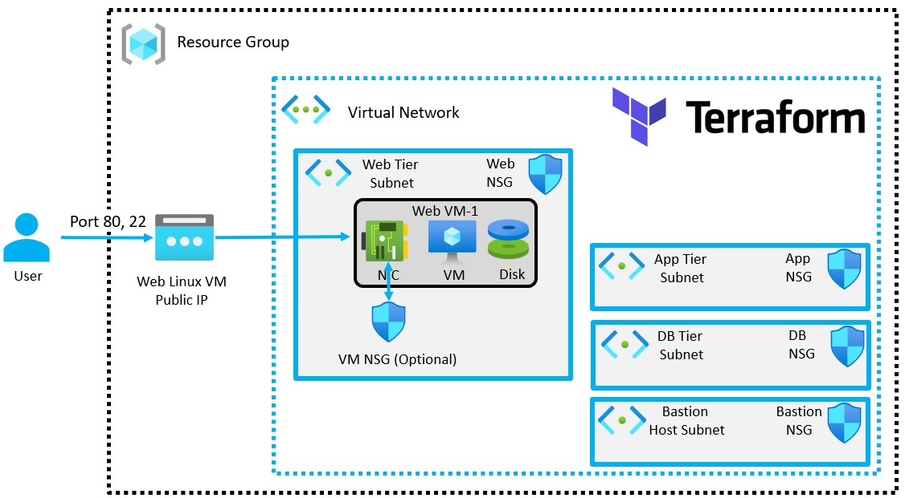

# Create a VM with a network security group

- The objective is to deploy a dotnet app on linux vm and make it accessible on the web.

- This builds [on this](https://github.com/AvtsVivek/AzureWithTerraformAdvanced/tree/main/iac/2101100-vnet-vm-nsg)

- Bastion subnet, app subnet and db subnet are removed.

- Web Network Security Group can be considered as the first level.

- VM Network Security Group(Optional) can be considered as the second level.

- Get the dotnet-install.sh script from here. https://docs.microsoft.com/en-us/dotnet/core/install/linux-scripted-manual#scripted-install

- Then place that /src/in dotnet-apps folder

- The apps are run as services using Systemd on Linux (RHEL)
  - https://swimburger.net/blog/dotnet/how-to-run-a-dotnet-core-console-app-as-a-service-using-systemd-on-linux
  - https://swimburger.net/blog/dotnet/how-to-run-aspnet-core-as-a-service-on-linux

- The following is the diagram downloaded from the Azure Portal.

- Reference. https://www.c-sharpcorner.com/article/deploying-asp-net-web-application-to-a-linux-virtual-machine-in-azure/

- Note: The following two commands must be run on the linux system.
  - sudo /usr/sbin/setsebool httpd_can_network_connect 1
  - sudo /usr/sbin/setsebool -P httpd_can_network_connect 1
  
  - Without them, it the services will not be accisible from outside. [See this](https://unix.stackexchange.com/q/8854/404099)

 

 

