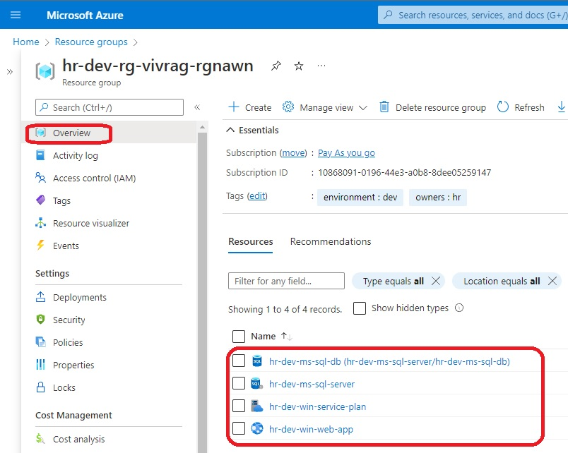
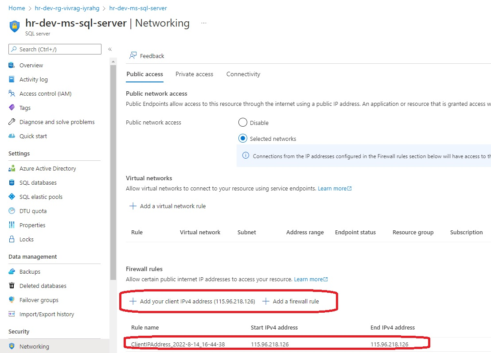
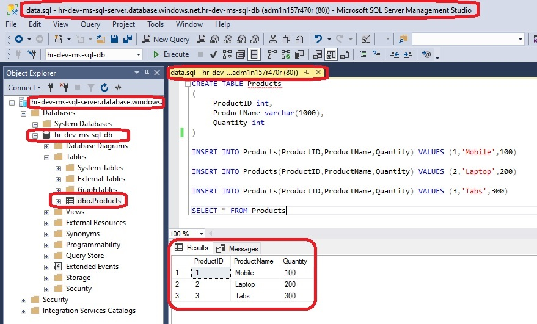
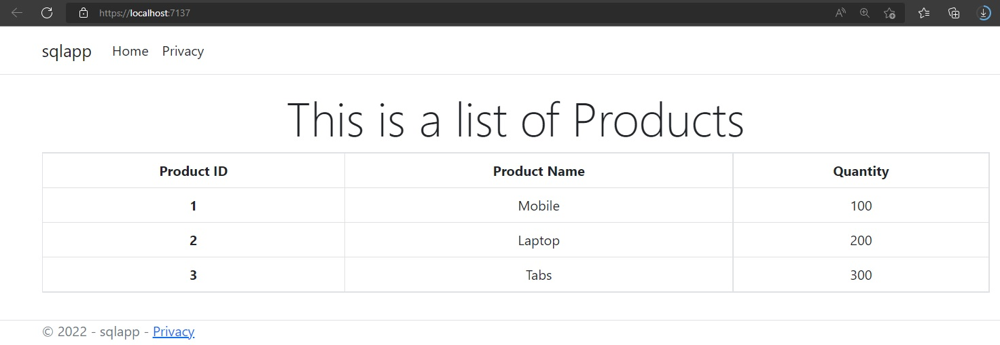
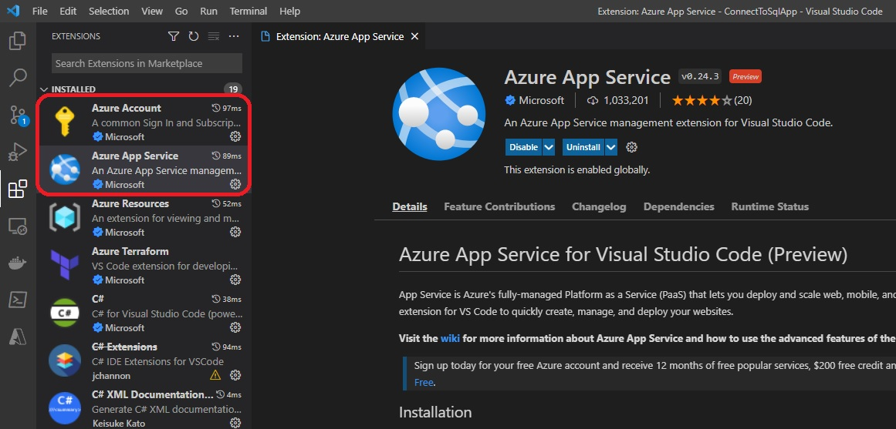
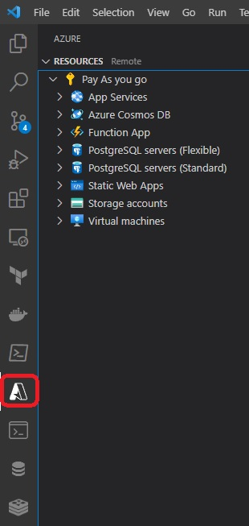
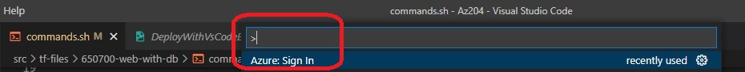
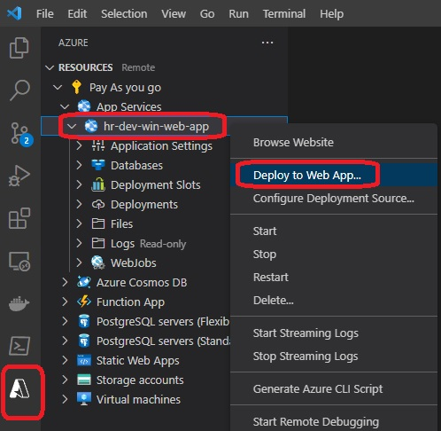

Sql Server and Sql Database with web app service

- Run the terraform files to create the required resources.
  - While creating, getting [this error as described in this github issue](https://github.com/hashicorp/terraform-provider-azurerm/issues/18311). So workaround is continue to execute the command plan and apply repeatedly. 

- Creates a Sql Server and Sql Database and windows web app.

- Visual Studio 2022 Deployment is not woring. So you can use Vs Code.

- Deployed resources

- Settings to Sql Server

- Add data

- Locally running web app

- First add the required extensiions

- Then Sign in to Azure. Press F1 in VsCode and then type Azure: Sign in

- Then Sign in to Azure. Press F1 in VsCode and then type Azure: Sign in

- Now deploy
  
- To deploy first open VsCode in the folder of the project you want to deploy. 
  - So if you want to deploy dotnet-apps/0020-simple-webapp/simple-webapp.csproj, first go to that folder
  -  cd dotnet-apps/0020-simple-webapp. Then follow the steps to deploy.

- There seems to be some problem with deployment currently. 

