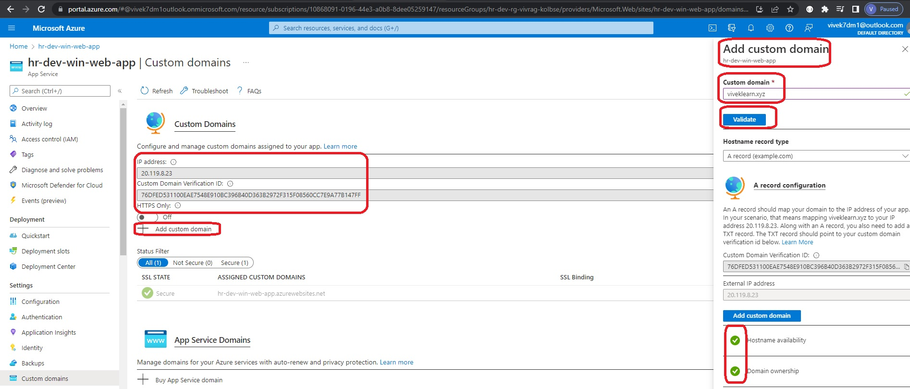

Sql Server and Sql Database

- To add a custom domain do the following.

- In this example, you can see both default, recurrence profile and also fixed profile in action.

- Layout

- Custom Domain   

- Custom Domain

- Custom Domain

- Custom Domain

- Custom Domain

- Custom Domain

- To impliment SSL

- S S L

- S S L

- S S L

- S S L

- S S L

- S S L

- S S L

- S S L

