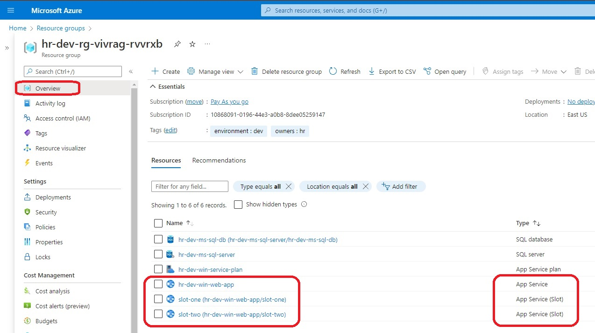
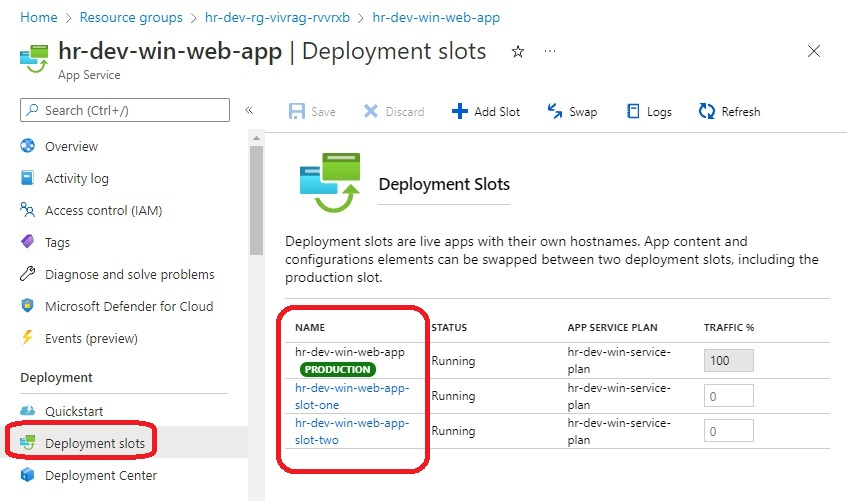
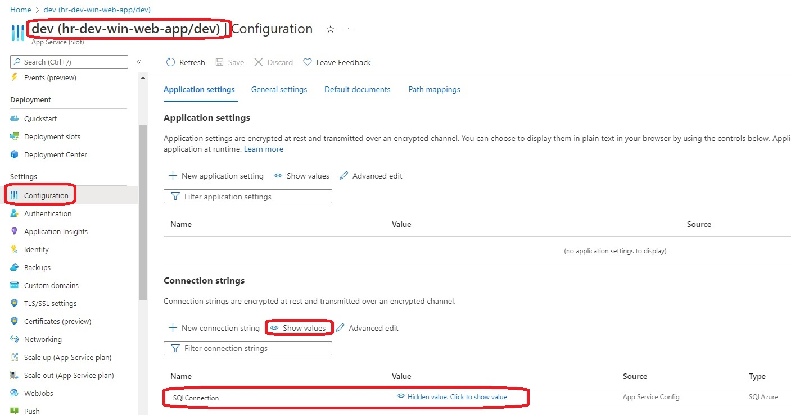
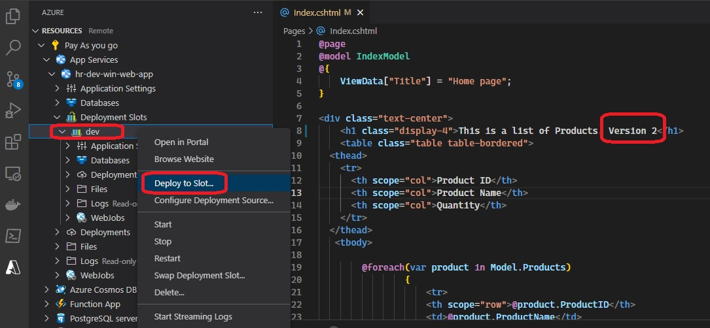
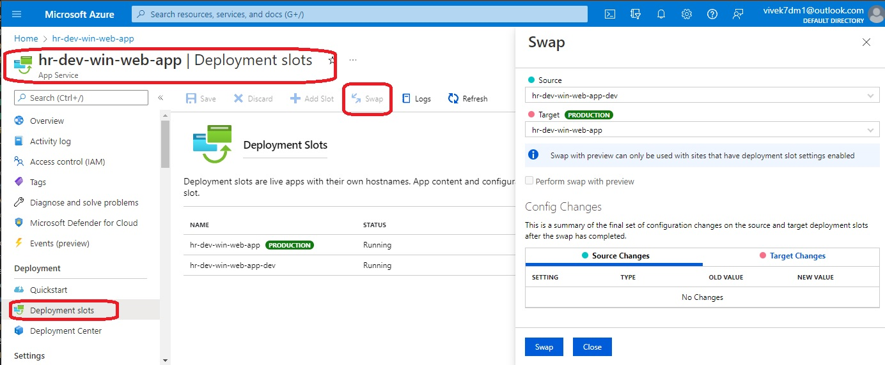
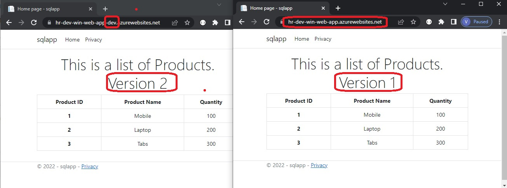

- This demonistrates deployment slots. 

- This builds on earlier example, but without autoscaling. All autoscaling code(tf7-03-app-auto-scaling-default-recurrence-fixed.tf) is commented out.

- If you want, you can include that as well. Just uncomment out the 

- Deployment Slots

- Take a look at the deployment slots.

- Ensure that the connection string is present in the newly created deployment slot as well.

- Do some changes to the app(basically some different version) and then deploy to the slot(not to the app)

- If you want to swap do the following.

- Both web site versions side by side.
