- This creates azure function with terraform 
  
- Run the terraform workflow commands. Once applied, you should see the following.
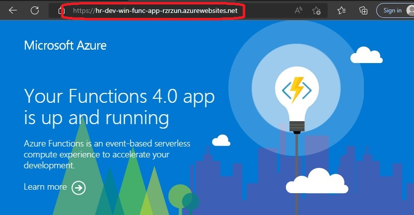

- Now you can create a trigger. Follow the steps below.
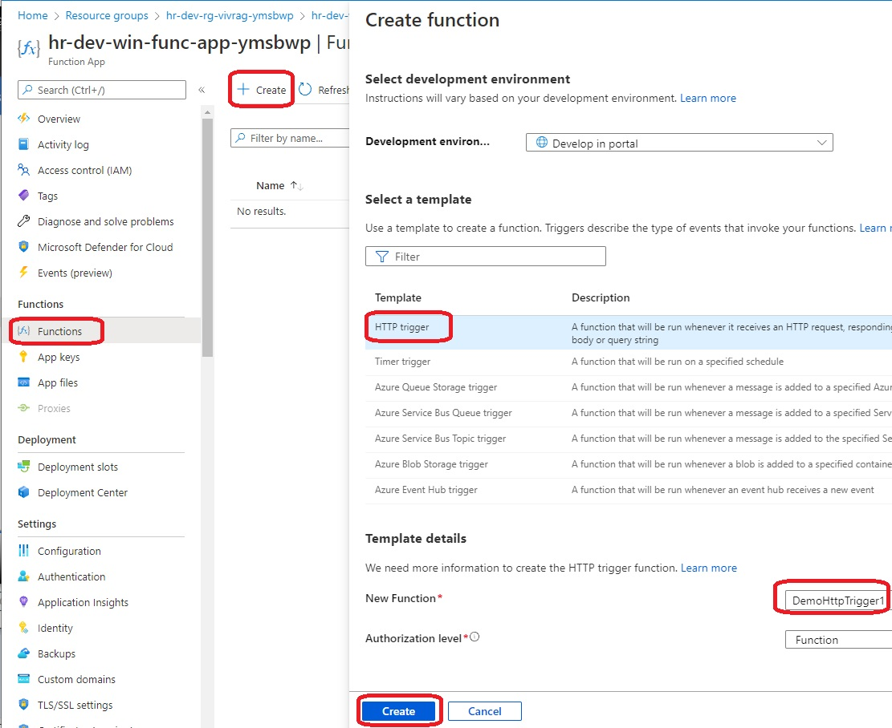

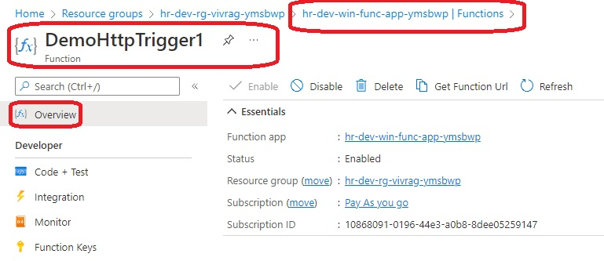

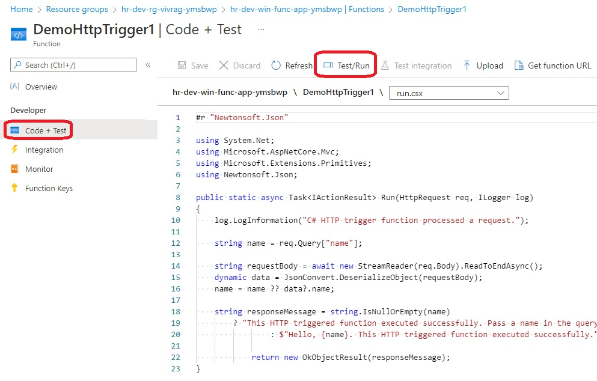

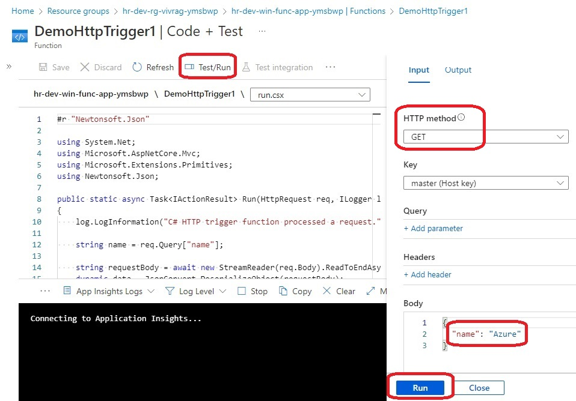

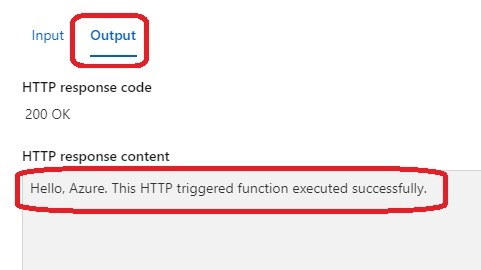

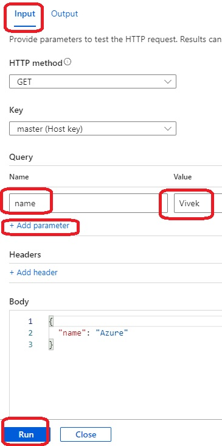

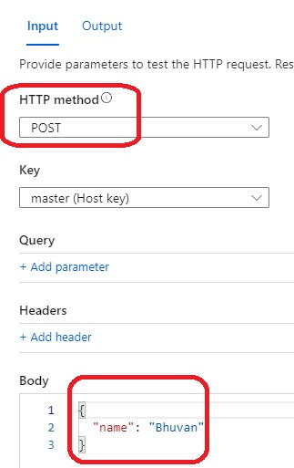

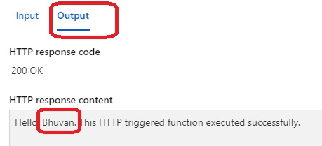

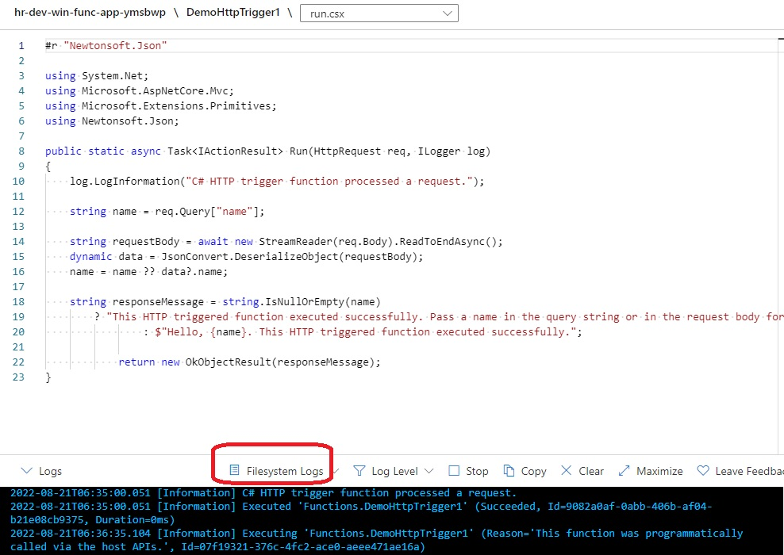

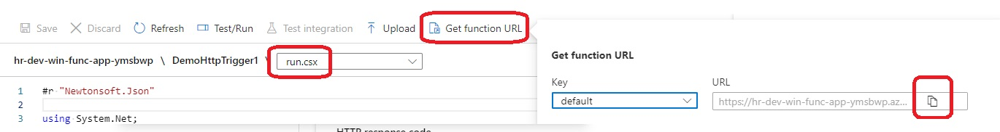

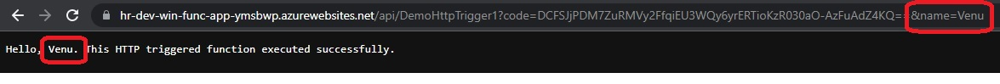

