- This creates azure function with terraform 
  
- The we will create a js based Azure Function in the /src/js-apps folder
  
- https://docs.microsoft.com/en-us/azure/azure-functions/functions-develop-vs-code?tabs=nodejs

- The following Pre requisties are needed.
https://docs.microsoft.com/en-us/azure/azure-functions/functions-develop-vs-code?tabs=nodejs#prerequisites

- First ensure vs code has extension installed.

- Run the terraform workflow commands. Once applied, we will now deploy a js based app to the deployed azure function.
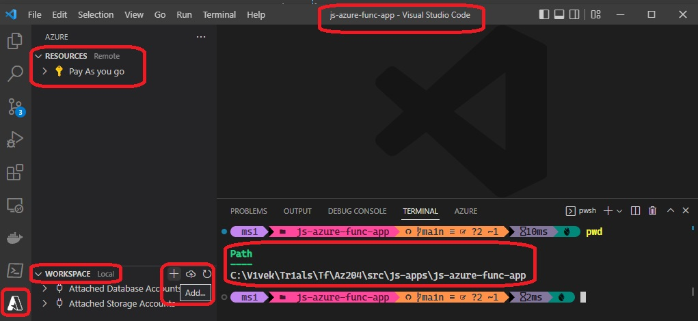

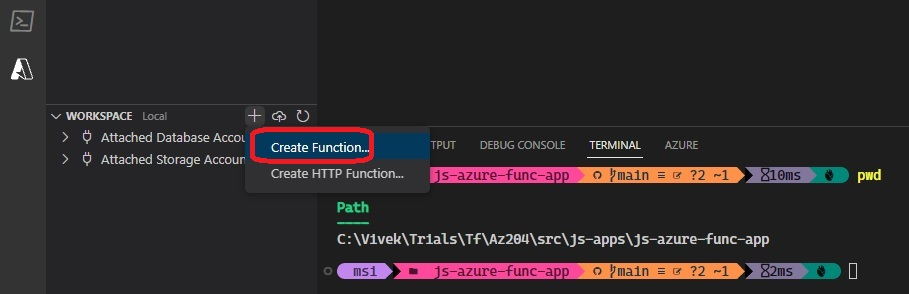

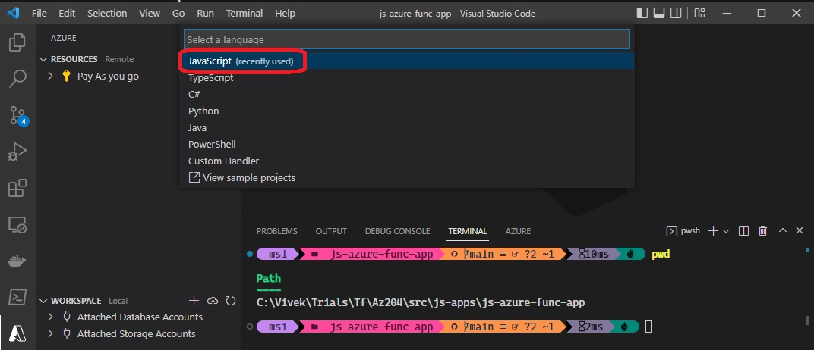

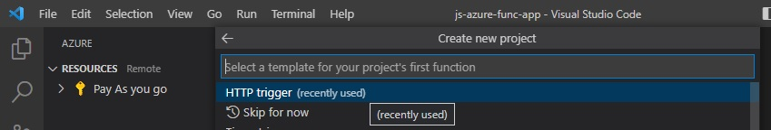

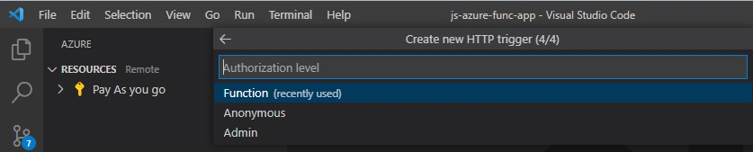

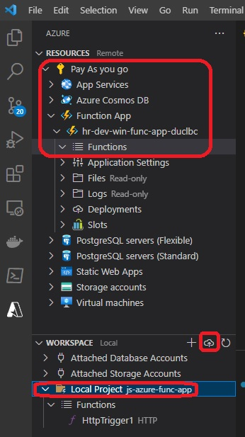

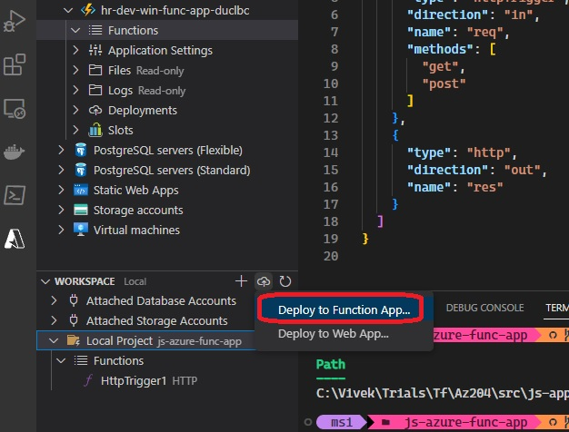

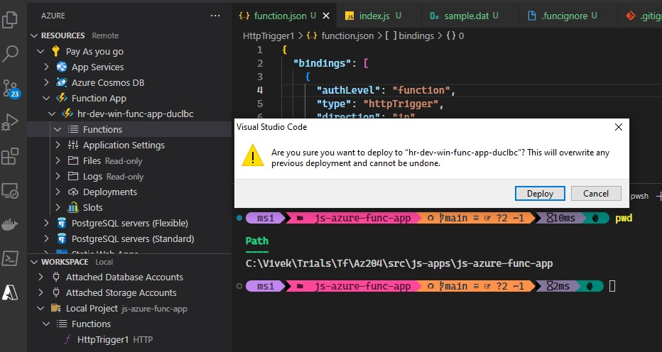

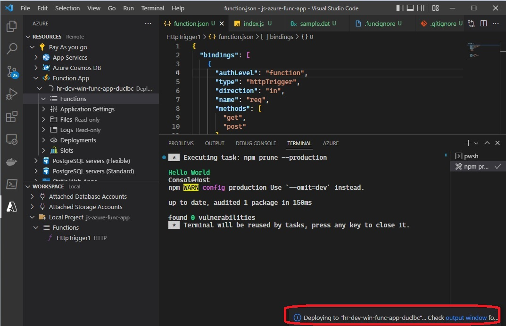

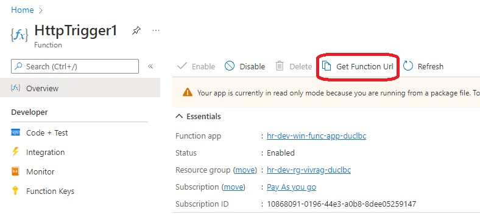

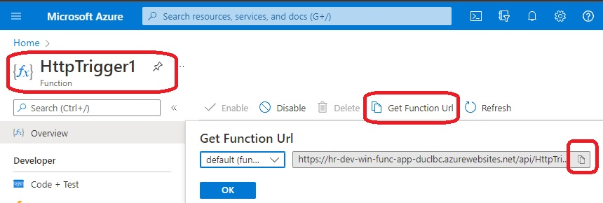

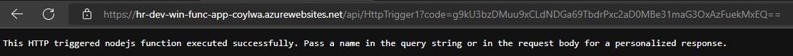

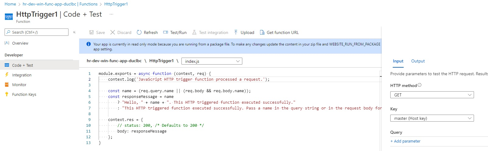

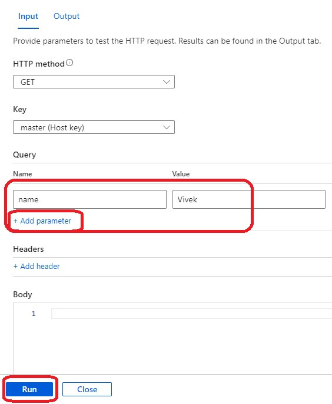

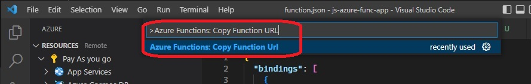

