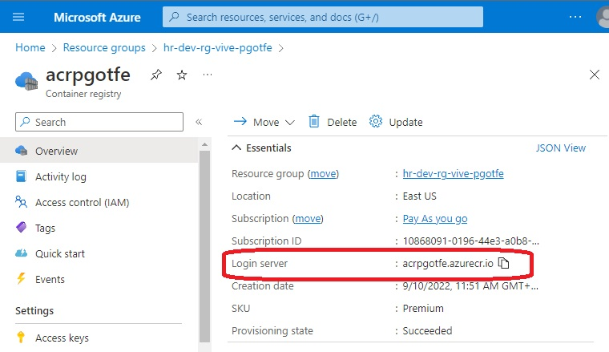
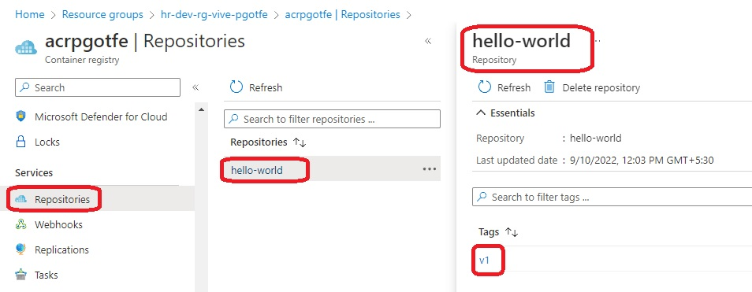
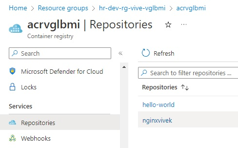
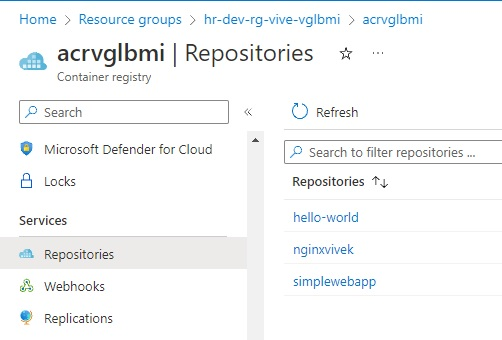

Azure Container Registry

- Objective is to deploy a azure conainer registry, then create an image for a dotnet application. Then push that to the container registry. Then pull that image and run it.

- Overall, we push three images.

- Azure Container Registry 

- Azure Container Registry 

- Azure Container Registry 

- Azure Container Registry 

