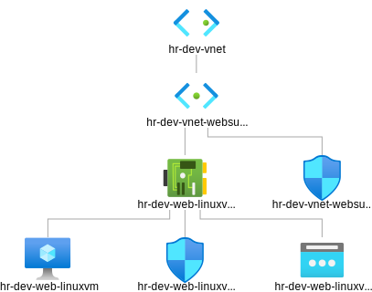
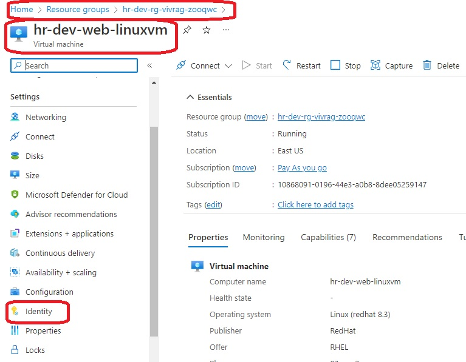

# Create a VM with a network security group

- This builds [on this](https://github.com/AvtsVivek/Az204WthTerraform/tree/main/src/tf-files/601010-linux-docker-nginx) where we build a vm, then provision with docker, then run an nginx contianer on it. Then you can access that page from internet, public IP. 

- The it additionaly adds [Azure Container Registry based on this](https://github.com/AvtsVivek/Az204WthTerraform/tree/main/src/tf-files/810010-azure-container-registry).

- Also we need to create [User Assigned Indetitie as explained here](https://docs.microsoft.com/en-us/azure/container-registry/container-registry-authentication-managed-identity?tabs=azure-cli). Note we are creating user assigned identites, and not service assigned identities for this example.

- Then place that /src/in dotnet-apps folder


- The following is the diagram downloaded from the Azure Portal.



- Consider the following code. We are specifying the type of Managed Service Identity that should be configured(in this case System Assigned) on this Linux Virtual Machine 

```tf
identity {
  # type         = "UserAssigned"
  # If you use UserAssigned, then identity_ids should not be null
  # identity_ids = [azurerm_user_assigned_identity.appag_umid.id]

  type = "SystemAssigned"
}
```

- Access Control. Consider the following code. We are assigning a role to web linux vm identity. And the scope we are setting it to Azure Container Registry. The role is AcrPull, its a [built it role](https://learn.microsoft.com/en-us/azure/role-based-access-control/built-in-roles)
```tf
resource "azurerm_role_assignment" "vm_to_acr" {
  scope = azurerm_container_registry.acr.id
  role_definition_name = "AcrPull"
  principal_id = azurerm_linux_virtual_machine.web_linuxvm.identity[0].principal_id
}
```



- References
  - https://docs.microsoft.com/en-us/azure/container-registry/container-registry-authentication-managed-identity?tabs=azure-cli
  
  - https://docs.microsoft.com/en-us/azure/container-registry/container-registry-roles?tabs=azure-cli

  - https://docs.microsoft.com/en-us/azure/active-directory/managed-identities-azure-resources/overview

