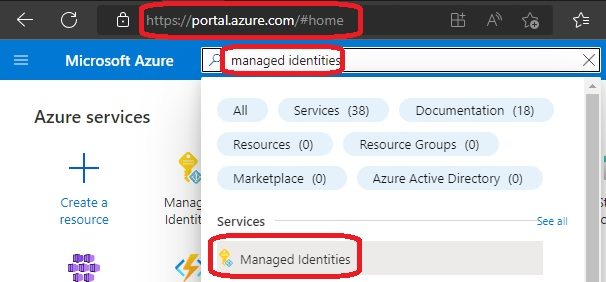
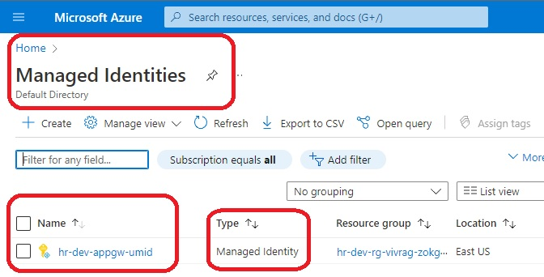
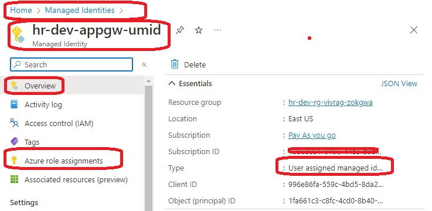
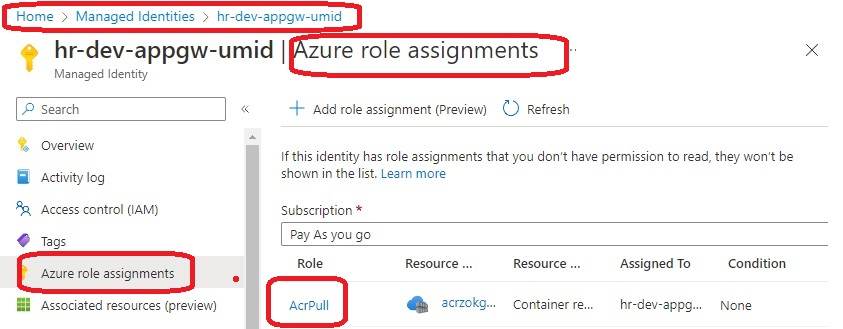
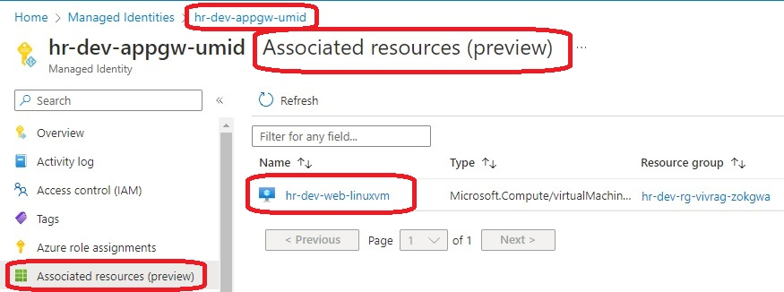
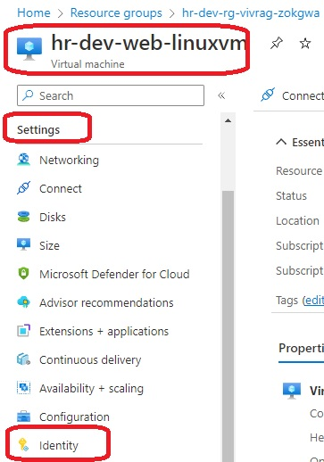
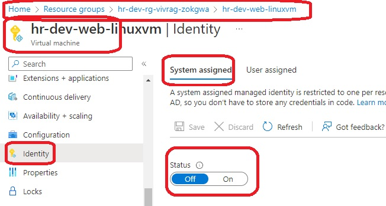
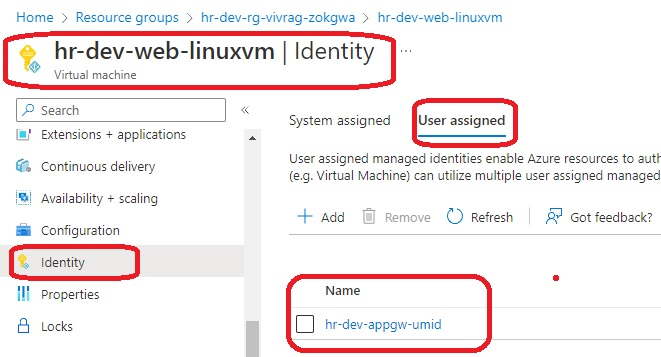

# Create a VM with a network security group

- This builds [on this](https://github.com/AvtsVivek/Az204WthTerraform/tree/main/src/tf-files/601010-linux-docker-nginx) where we build a vm, then provision with docker, then run an nginx contianer on it. Then you can access that page from internet, public IP. 

- The it additionaly adds [Azure Container Registry based on this](https://github.com/AvtsVivek/Az204WthTerraform/tree/main/src/tf-files/810010-azure-container-registry).

- Also we need to create [User Assigned Indetitie as explained here](https://docs.microsoft.com/en-us/azure/container-registry/container-registry-authentication-managed-identity?tabs=azure-cli). Note we are creating user assigned identites, and not service assigned identities for this example.

- Take a look at the file and its tf configs. tf9-azurerm-user-assigned-identity.tf

- Also review the following config in linux vm resource config file.

```
identity {
  type         = "UserAssigned" #"SystemAssigned"
  identity_ids = [azurerm_user_assigned_identity.appag_umid.id]
}
```

- Now take a look at the following images.


















- The following is the diagram downloaded from the Azure Portal.


- References
  - https://docs.microsoft.com/en-us/azure/container-registry/container-registry-authentication-managed-identity?tabs=azure-cli
  
  - https://docs.microsoft.com/en-us/azure/container-registry/container-registry-roles?tabs=azure-cli

  - https://docs.microsoft.com/en-us/azure/active-directory/managed-identities-azure-resources/overview

