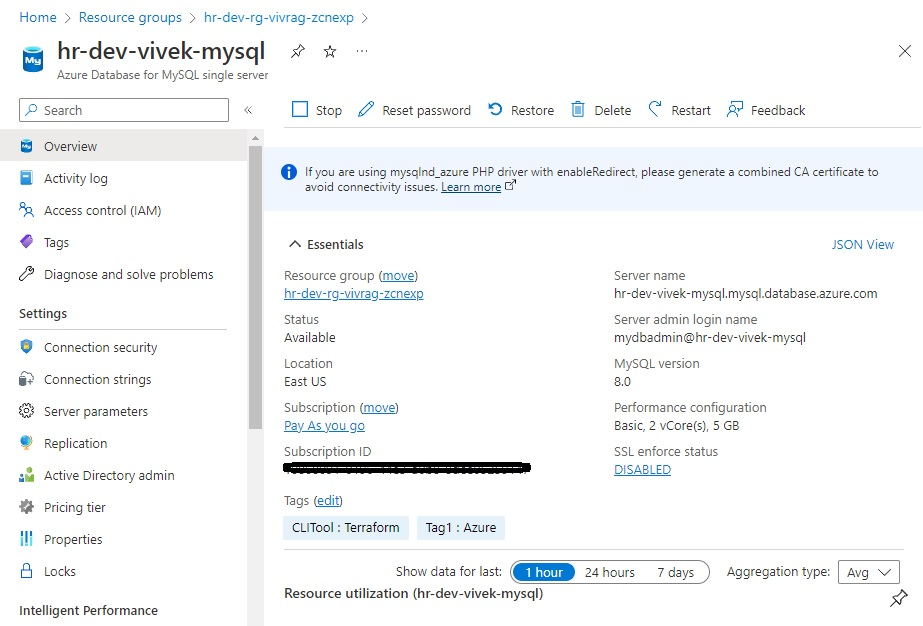
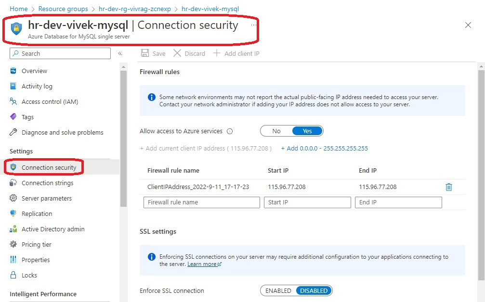
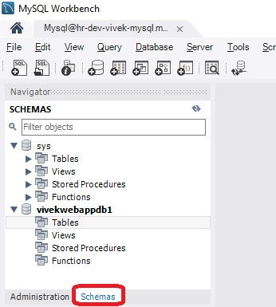
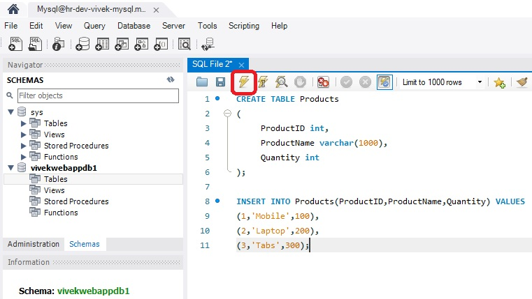
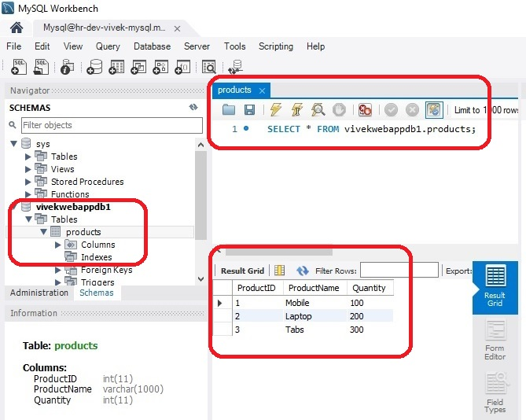

## MySql database

- This deploys a mysql server and a database on it.

- Then you can load some data on to it. Take a look at the images.

- Once data is loaded and database ready, you can then get the connection string and run an application that depends on it. 
  - The [app that depends on it is this](https://github.com/AvtsVivek/Az204WthTerraform/tree/main/src/dotnet-apps/0150-ConnectToMySqlAppWithConString).
  - [The connection string is here](https://github.com/AvtsVivek/Az204WthTerraform/blob/main/src/dotnet-apps/0150-ConnectToMySqlAppWithConString/ConnectToMySqlAppWithConString/appsettings.json).

- MySql 1

- MySql 2

- MySql 2

- MySql 2

- MySql 2

- MySql 2

