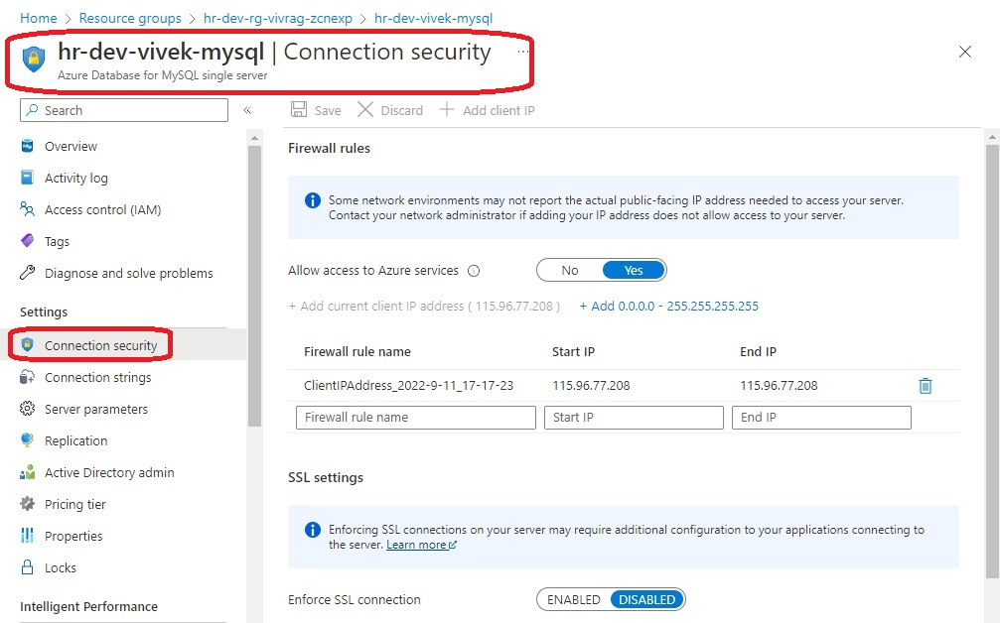
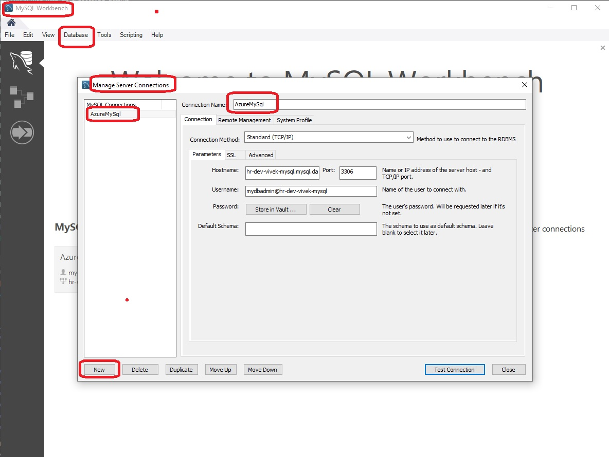
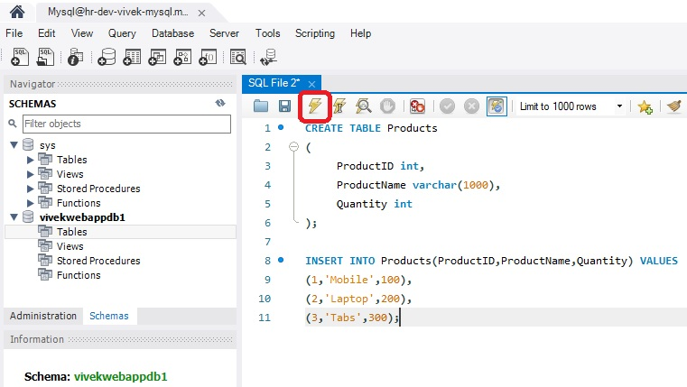

## MySql database

- This deploys a mysql server and a database on it.

- Then you can load some data on to it. Take a look at the images.

- MySql 1

- MySql 2

- MySql 2

- MySql 2

- MySql 2

- MySql 2

