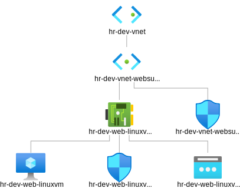

# Create a VM with a network security group

- This builds [on this](https://github.com/AvtsVivek/Az204WthTerraform/tree/main/src/tf-files/601010-linux-docker-nginx)

- Deploys a linux VM, then provisions a docker, then starts a docker nginx container and also mysql container.
  
- My sql runs on 3306 port, and nginx on default 80.
  
- Then you can access that page from internet, public IP.

- Bastion subnet, app subnet and db subnet are removed.

- Web Network Security Group can be considered as the first level.

- VM Network Security Group(Optional) can be considered as the second level.

- The following is the diagram downloaded from the Azure Portal.

- My Sql container
  
  

