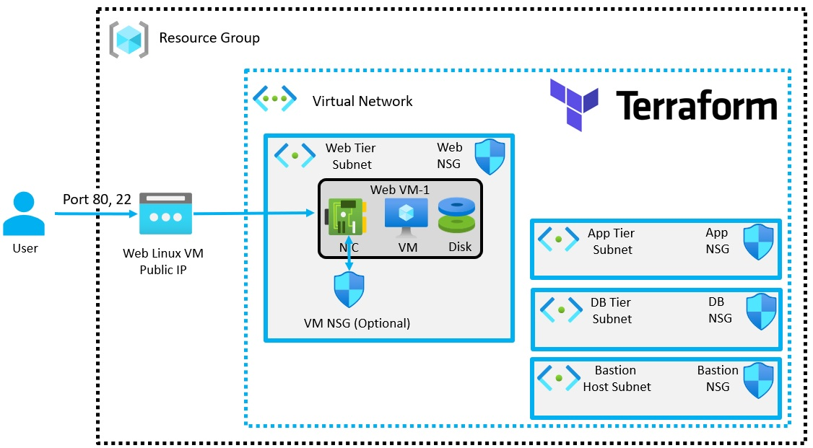
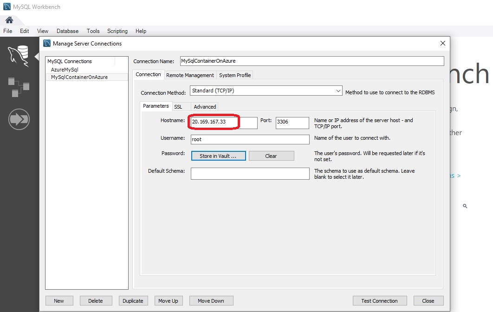

# Create a VM with a network security group

- This builds [on this](https://github.com/AvtsVivek/Az204WthTerraform/tree/main/src/tf-files/601010-linux-docker-nginx)

- Deploys a linux VM, then provisions a docker, then starts a docker nginx container and also mysql container.
  
- My sql runs on 3306 port, and nginx on default 80.

- Then you can access that page from internet, public IP.

- In the resource **azurerm_linux_virtual_machine**(or even windows vm for that matter) there is an argument called **custom_data**.
This helps in executing scripts after the deployment of the vm. Either we can use in line scripts or a file which has scrpts.
The execution of this script is taken care by terraform.
But the downside of this is, this happens immediately after the deployment. 
So if you need to pass on any files to the vm before running any of the scripts,
and you want to use those files in running the scripts, then this is not ideal. 
So lets say we want to copy some files after deployment, say a Dockerfile to create a docker image.
This **custom_data** will not be of help. Because the file provisioner will run after this custom_data script run.
This scipt executes before any terraform file provisioner is executed.
So its better to use **remote-exec** provisioner in such cases.
So in such a case, we can have file provisioner run, and then the remote-exec provisioner. 

- Bastion subnet, app subnet and db subnet are removed.

- Web Network Security Group can be considered as the first level.

- VM Network Security Group(Optional) can be considered as the second level.

- The following is the diagram downloaded from the Azure Portal.

- My Sql container
  
  

