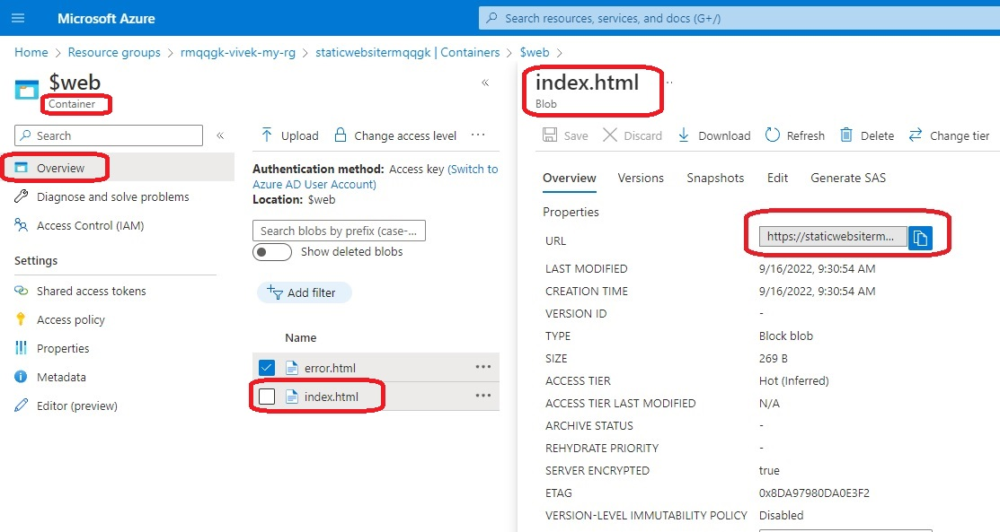
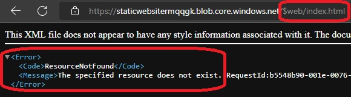
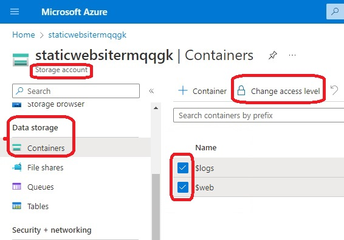
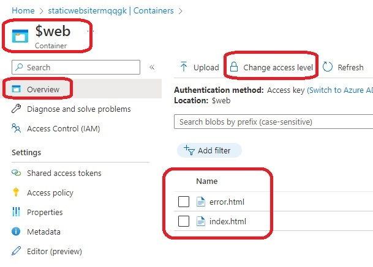
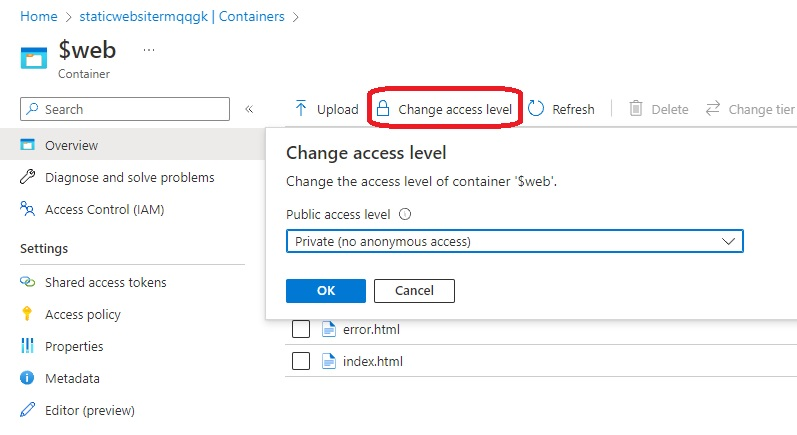
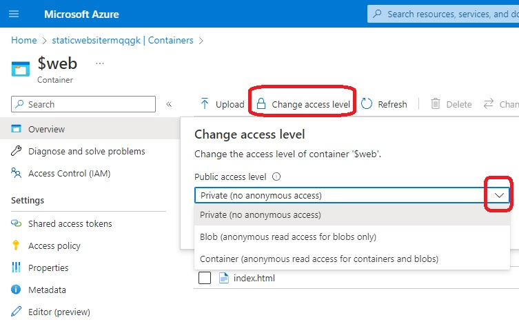

# Storage Accounts, static web site

- This builds on previous exercise. Now adds blobs(index.html and error.html)

- Enabling Static Website creates a container with name $web. 

- Also note that Static Web site has got an end point, index and error page. See screen shots in the images folder.

- Also observe that $web container now contains files.. 
  - Also the static web site is configured with error page and index page.

- To upload the files we need to do that seperately using a azurerm_storage_blob resource. Thats what we have done in this exercise.

- We have already noted enabling Static Website creates a container with name $web. But if we want to explictely configure this container using the following 
    azurerm_storage_container(like for example, we cant to change container_access_type to container) its not working.

```
resource "azurerm_storage_container" "asc_cont" {
  name                  = "$web"
  storage_account_name  = azurerm_storage_account.storage_account.name
  # https://registry.terraform.io/providers/hashicorp/azurerm/latest/docs/resources/storage_container#container_access_type
  container_access_type = "container" # Possible values are blob, container or private. Defaults to private.
}
```

- Finally, note that you cannot directly access the uploaded blob files directly using their urls.
  - 
  - As you can see, the urls do exist. But when you access them, you get 404 not found.

- 
  
- The reason is the access level.

- You can change the access level to all of the containers or individual containers as follows from the portal.

- 

- 

- 

- 

- 