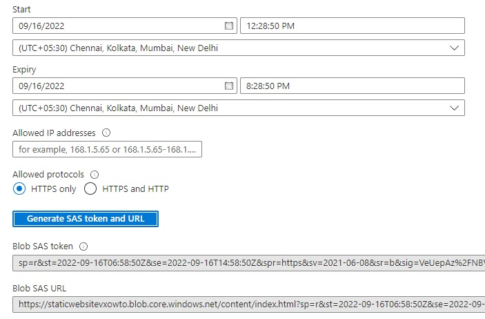
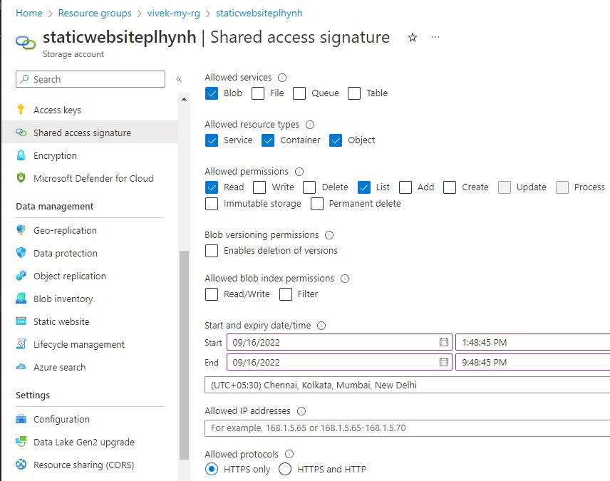

# Storage Accounts

- This builds on the previous blob storage demo, but this changes the access level of a container using the container resource.
  - azurerm_storage_container

- See below for differnt types of access. Access Keys, Shared Access Signatures at blob leve, at account level 

- 

- 

- 

- [Introducing Azure Storage Explorer](https://azure.microsoft.com/en-us/products/storage/storage-explorer/).

- 

- 

- 

- 

- 

- With Access Keys

- 

- 

- 

- 

- 

- There is also Shared Access Signature at blob level.
  - If you want a user to access a resource for say one week, then you can generate shared access signature.
  
- 

- 

- 

- 
