# Storage Accounts

- This builds on the previous blob storage demo, but this changes the access level of a container using the container resource.
  - azurerm_storage_container

- See below for differnt types of access. Access Keys, Shared Access Signatures at blob leve, at account level 

- See the images. Need to write up.

- 

- 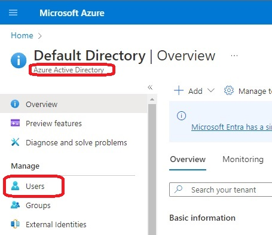

- 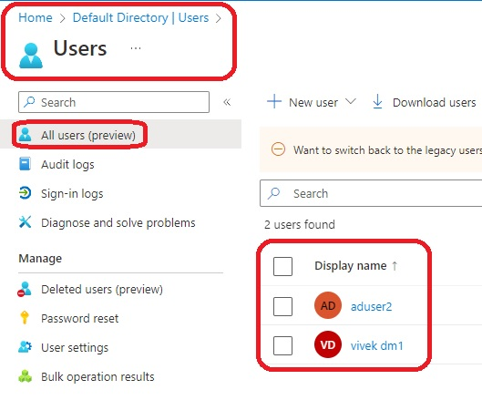

- 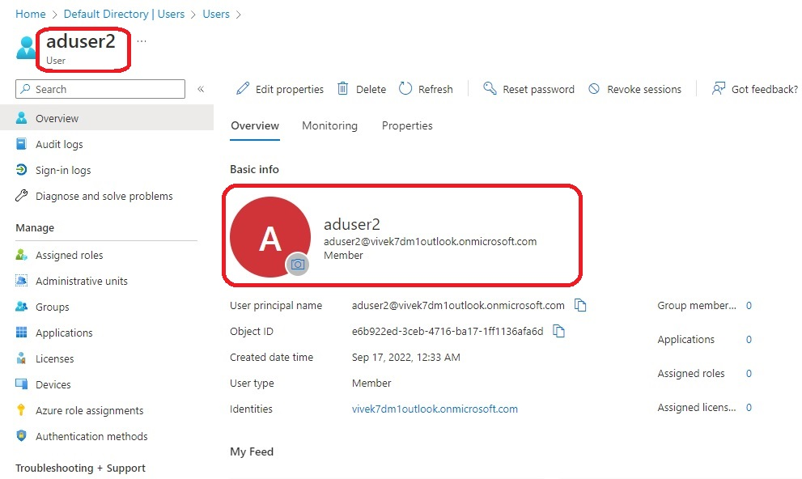

- 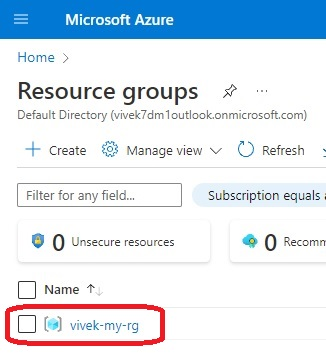

- 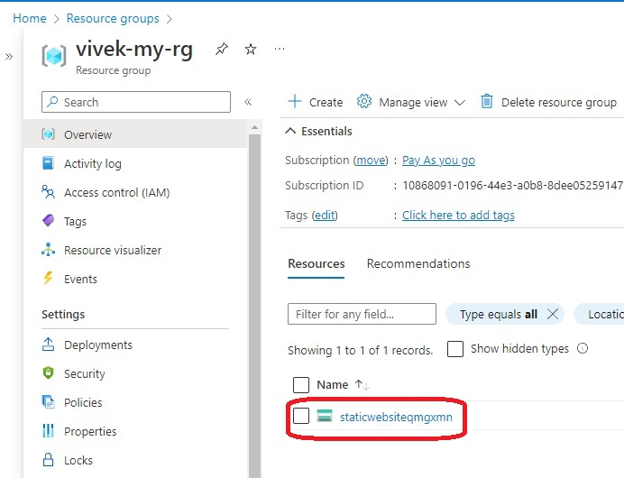

- 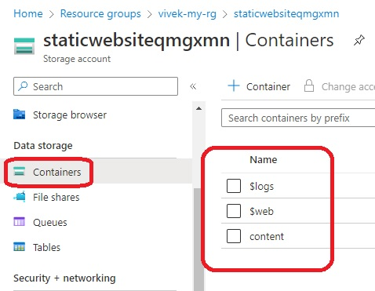

- 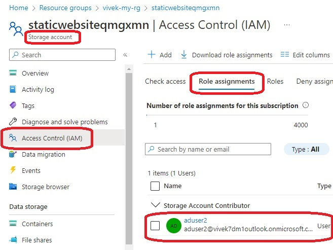

- 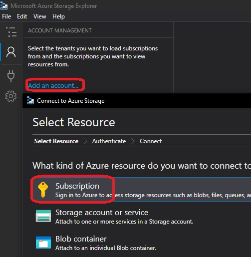

- 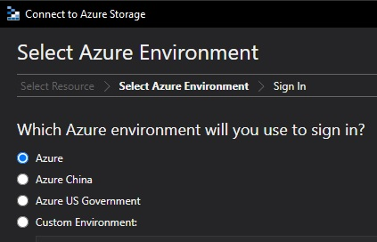

- 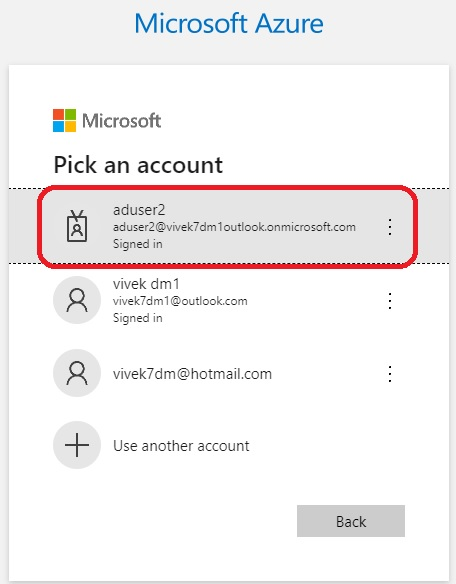

- 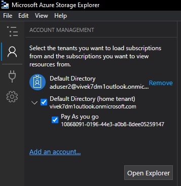

- 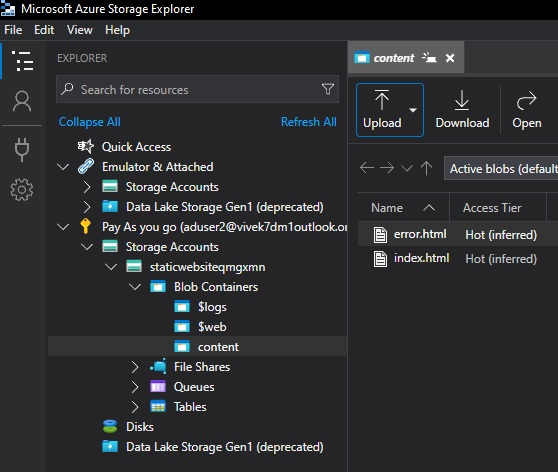

