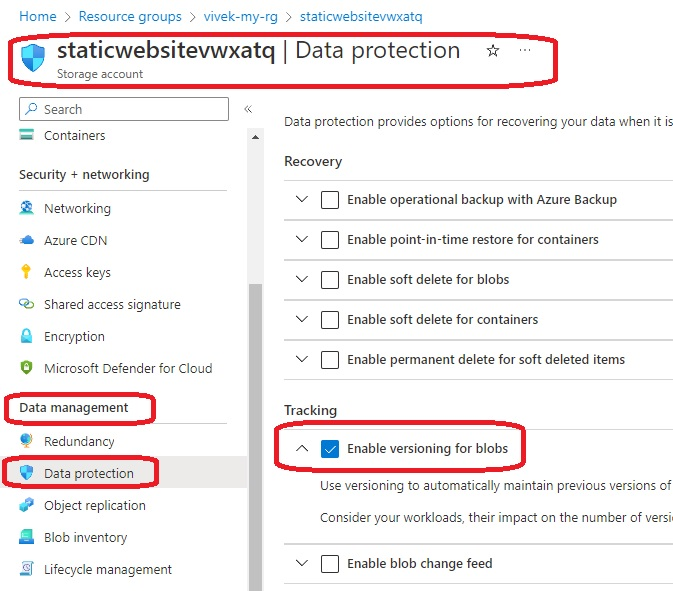
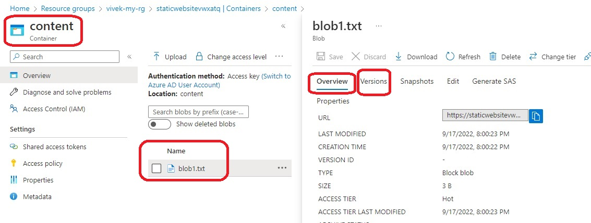
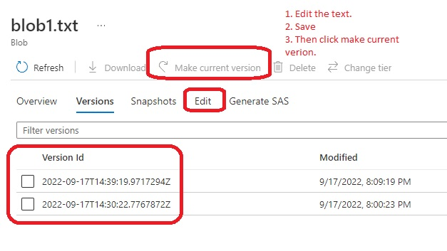

# Storage Management Policy

- azurerm_storage_management_policy is the resource.

- Once you plan and apply the config, you should see the storage created. 

- Note the azurerm_storage_account.storage_account resource. You should see blob_properties block and inside of it versioning_enabled = true.

```
blob_properties {
  versioning_enabled = true
}
```
- Once the Resource is ready on Azure, take a look at Data Management. 







- 