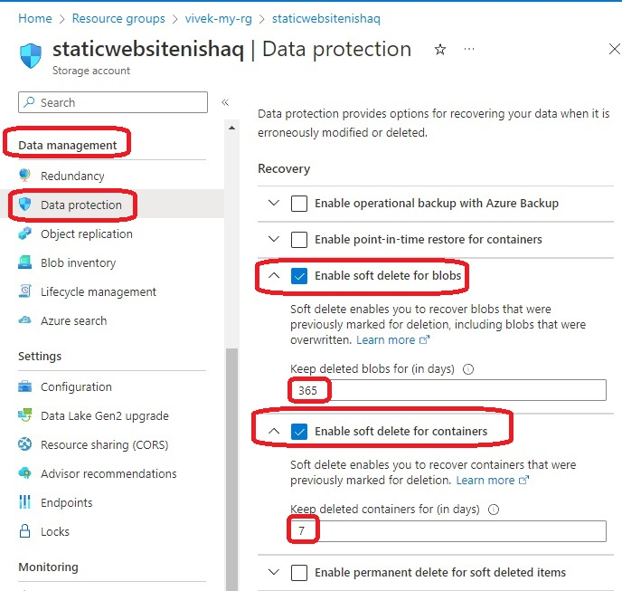
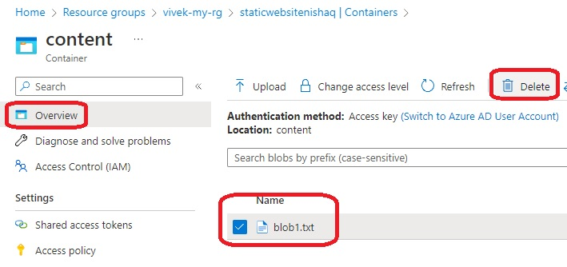
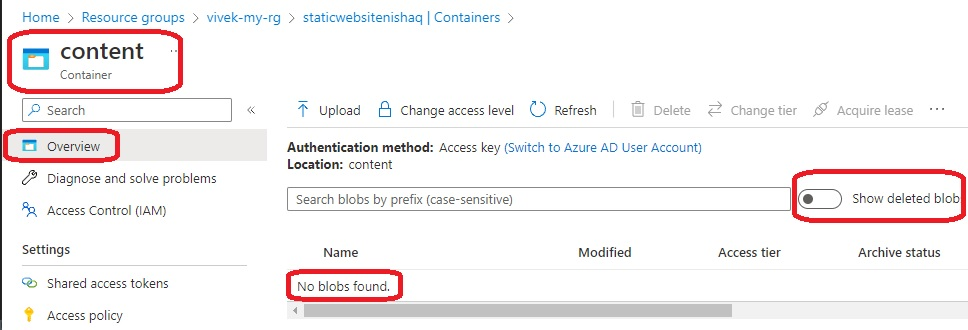
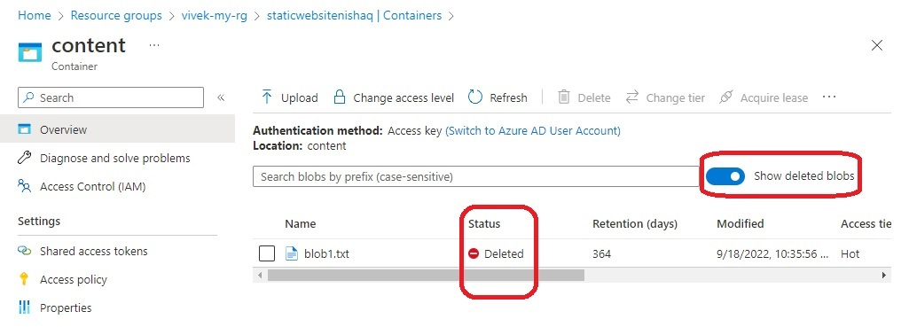
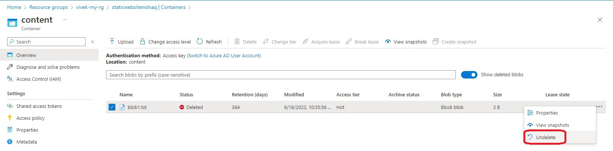
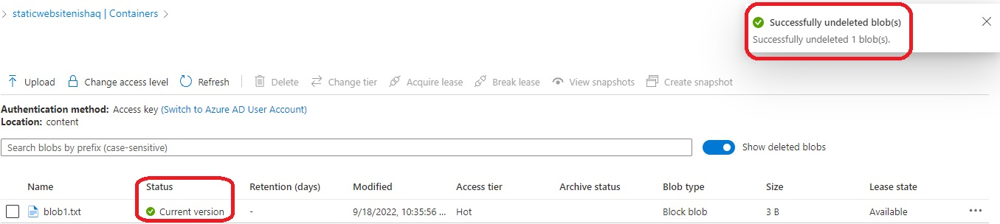
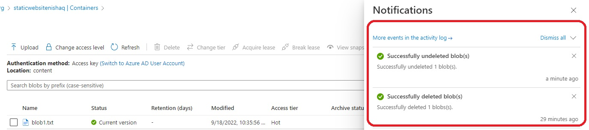

# Soft Deletion and Retention

- Execute Plan and Apply the config.

- Note the following in the azurerm_storage_account resource.

```
blob_properties {
  delete_retention_policy {
    days = 365
  }
  container_delete_retention_policy {
    days = 7
  }
}
```

- Now take a look at the images.



- Now delete the blob.



- Now verify.





- Now if you want to undelete, or restore.








