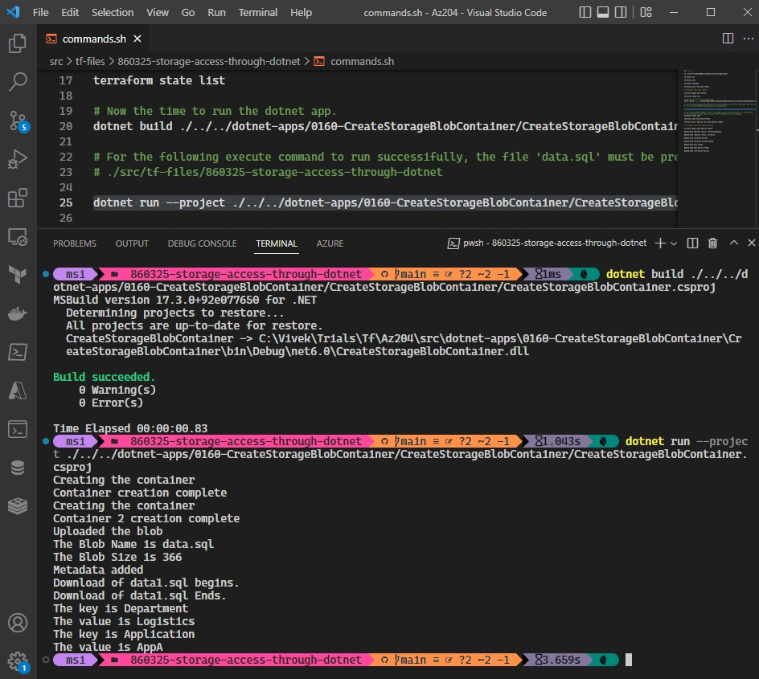

# Soft Deletion and Retention

- Execute Plan and Apply the config.

- Now verify and then get the connection string from the Access Keys


- Find the connectionString variable in the [dotnet app project in this file](https://github.com/AvtsVivek/Az204WthTerraform/blob/main/src/dotnet-apps/0160-CreateStorageBlobContainer/CreateStorageBlobContainer/Program.cs).

```
var connectionString = "DefaultEndpointsProtocol=https;AccountName=staticwebsitenishaq;AccountKey=l2XMSaoxhxAGgwIMdh1L03S5B34WDa+Dvw0JBIRGqGuQpL+f0STbb/5VI/w46jQfsbUFwrWIjeQ8+AStGnb6SA==;EndpointSuffix=core.windows.net";
```

- Once evereything is set, then run the dotnet command. 
```
dotnet build ./../../dotnet-apps/0160-CreateStorageBlobContainer/CreateStorageBlobContainer/CreateStorageBlobContainer.csproj

dotnet run --project ./../../dotnet-apps/0160-CreateStorageBlobContainer/CreateStorageBlobContainer/CreateStorageBlobContainer.csproj
```


- If everything is successifull, then you should see the containers as follows.


- If you want to run the project using Visual Studio, then ensure data.sql file is present in the porject as follows. The file data.sql should be copied to the out put directory. Right click and select properties and ensure the props are set as follows.


- Ensure the data.sql file is uploaded.


- Ensure data1.sql file is downloaded. 
  - If you execute the dotnet run command, then the data1.sql will be downloaded to the following folder.
  - ./src/tf-files/860325-storage-access-through-dotnet
  - If you run the project from Visual Studio, then the data1.sql will be downloaded to the 
  - 0160-CreateStorageBlobContainer\CreateStorageBlobContainer\bin\Debug\net6.0
  