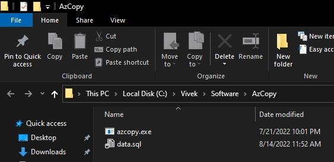
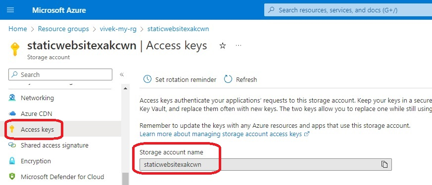
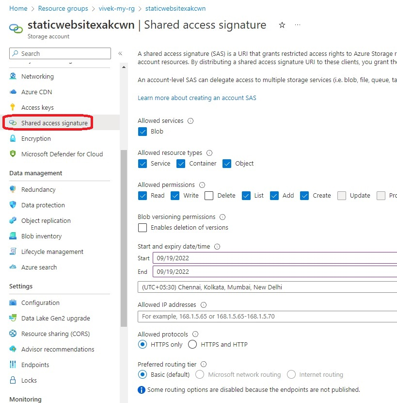
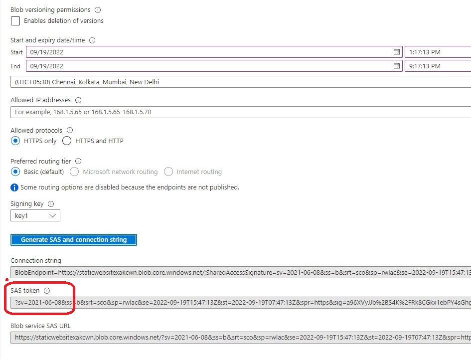
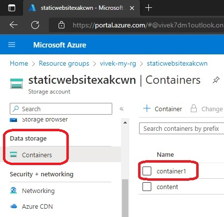
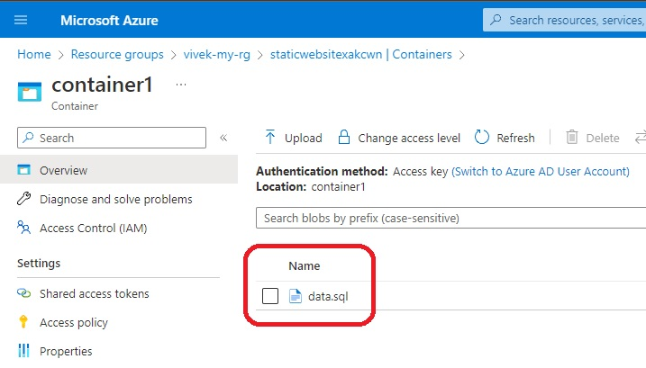
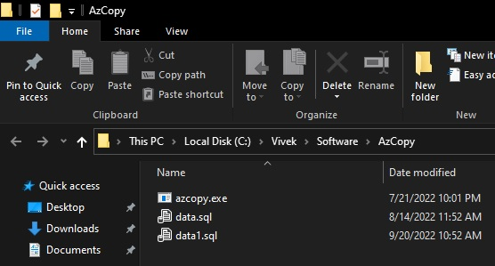

# Soft Deletion and Retention

- References
  - https://learn.microsoft.com/en-us/azure/storage/common/storage-use-azcopy-v10
  - https://learn.microsoft.com/en-us/azure/storage/common/storage-ref-azcopy
  - 

- Execute Plan and Apply the config.

- Now verify 

- [Download the AzCopy tool from here](https://learn.microsoft.com/en-us/azure/storage/common/storage-use-azcopy-v10#download-azcopy) and extract to a folder of your choice.

- Place it in a folder.
 

- Generate the SAS token as follows.

- Generate the SAS token as follows.

- Pick the SAS token.

