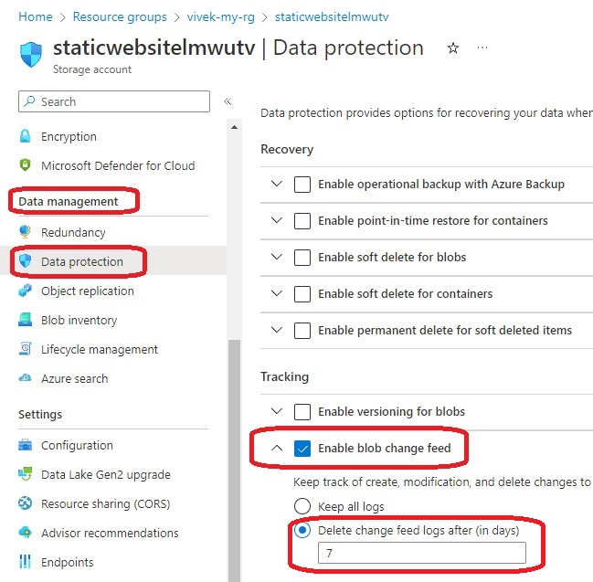
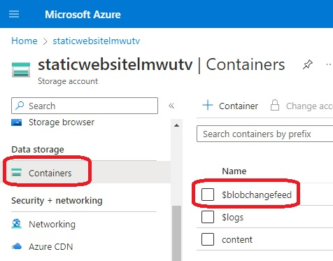
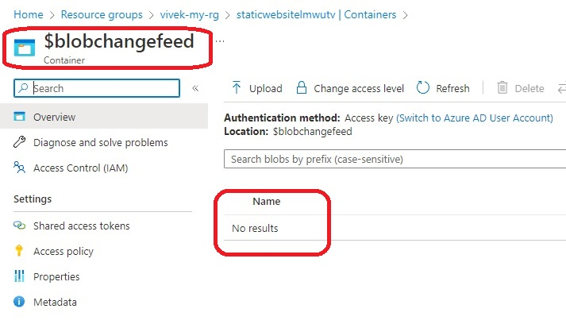
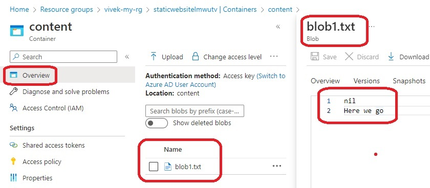
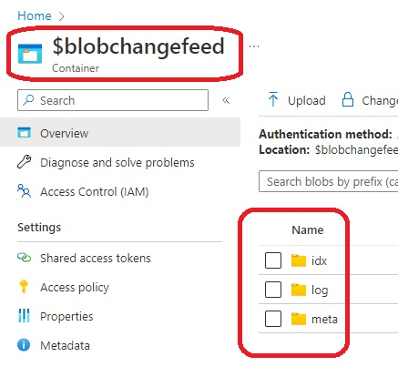
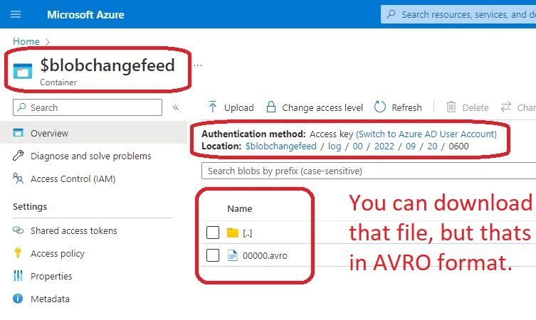

# Storage Change Feed

1EnableBlobChangeFeed1.jpg

```
blob_properties {
  change_feed_enabled = true
  change_feed_retention_in_days = 7
}
```

- Because of the above config, we can see the following.


- Also we can notice the following. A new container is created just for the feeds. You may have to wait for a minute or two, only then this will be visible.


- Intially as you can see, there are no files inside of this container.


- Make some changes to your file, blob1.txt
 

- Wait for a few minutes, and after a few minutes(5-10 minutes), you should see the following.


- Wait for a few minutes, and after a few minutes(5-10 minutes), you should see the following.


