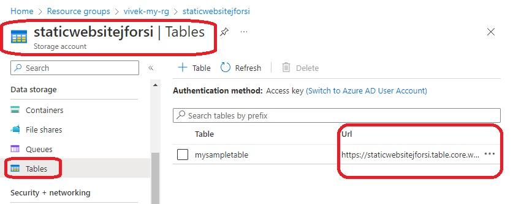
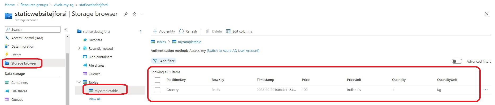

# Table Storage

```
resource "azurerm_storage_table" "example" {
  name                 = "mysampletable"
  storage_account_name = azurerm_storage_account.storage_account.name
}

resource "azurerm_storage_table_entity" "example" {

  storage_account_name = azurerm_storage_account.storage_account.name
  table_name           = azurerm_storage_table.example.name

  partition_key = "Grocery"
  row_key       = "Fruits"

  entity = {
    Price        = "100"
    PriceUnit    = "Indian Rs"
    Quantity     = "1"
    QuantityUnit = "Kg"

  }
}
```

- The config above creates the following resources.





