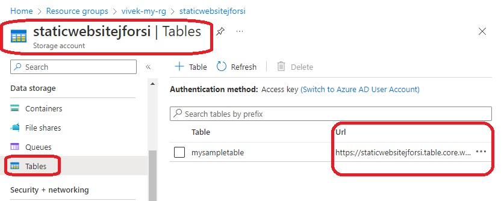
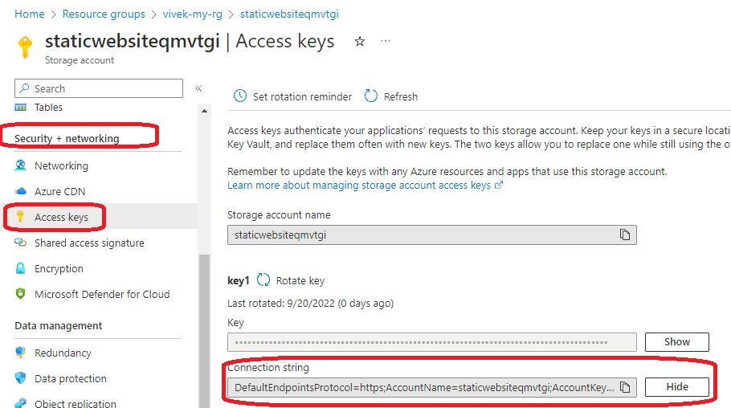
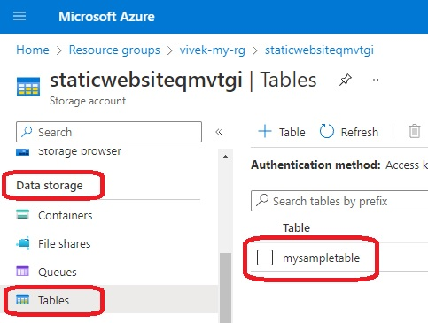
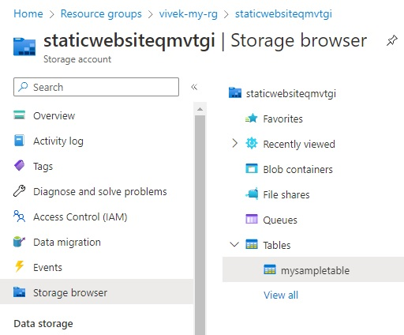
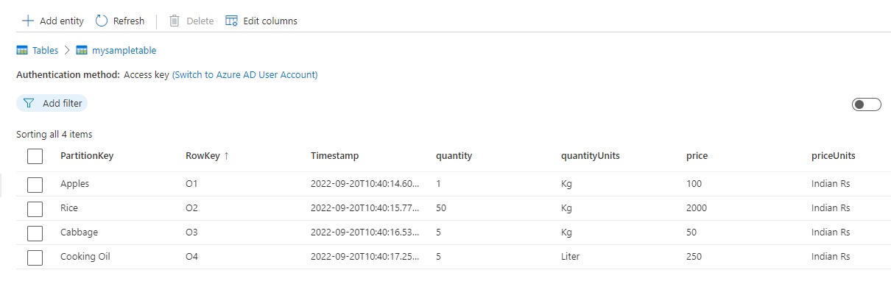

# Table Storage

```
resource "azurerm_storage_table" "example" {
  name                 = "mysampletable"
  storage_account_name = azurerm_storage_account.storage_account.name
}

```

- The config above creates the following resources.



- Once deployed, get the connection string.










