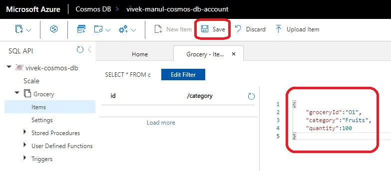
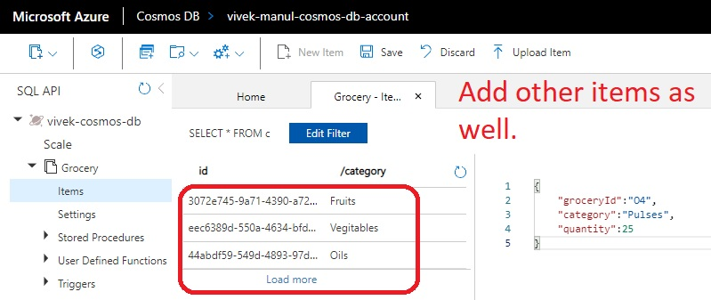
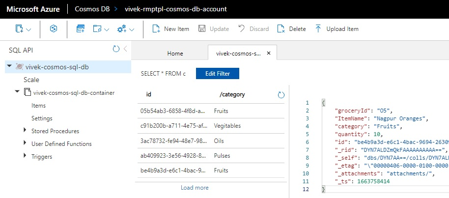

# Table Storage

- The attempt is to create a cosmos db account which is similar to the one created manually.

- We can add a database and container, but not item. 

- So we can add **azurerm_cosmosdb_sql_database** and within that, a container as **azurerm_cosmosdb_sql_container**

- Now to add an item within that container using terraform, there is no way to do that. 

- The [github item here](https://github.com/hashicorp/terraform-provider-azurerm/issues/9023) as on today is still open.

- So we need to add items using other means, such as through portal, or using some apis and calling those apis.

- Add items as follows.

- 

- 

- 

- 

- 

  