# Table Storage

- Demos Cosmos Db trigger on Azure function.

- The config files when applied(plan, apply) then the following resources are created.

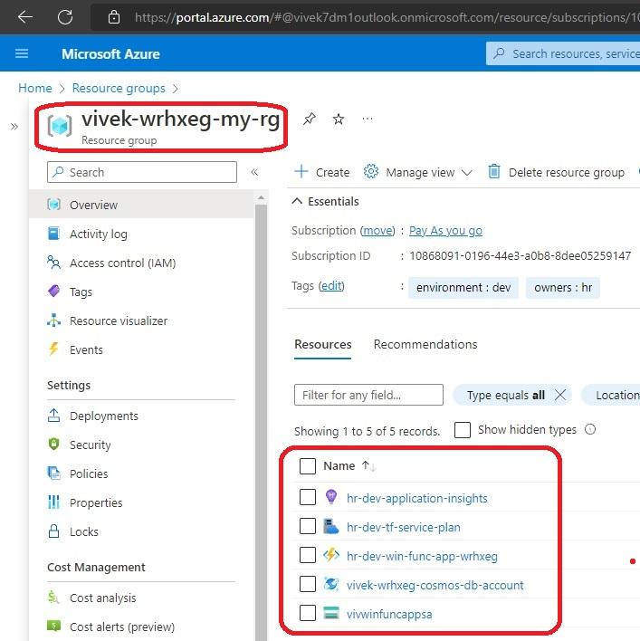

- Review the resources.

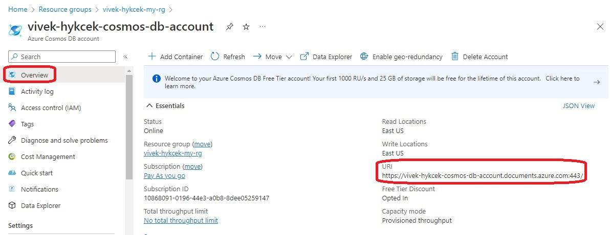

- Get the keys and then update the Program.cs file in the project dotnet-apps/0170-TableStorage/TableStorage/TableStorage.csproj

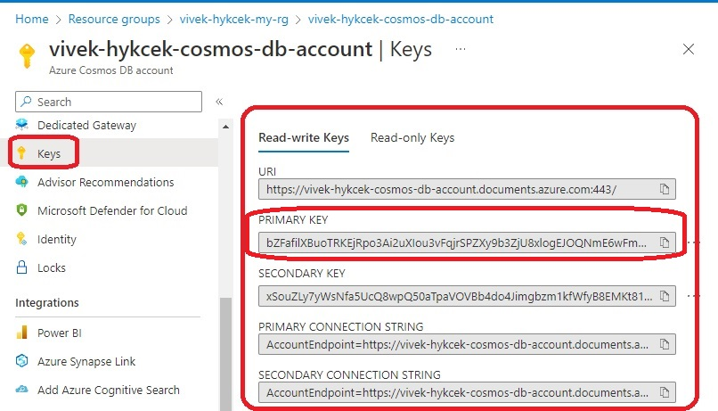

- Then run the following command to create db and populate with data.

```cs
dotnet build ./../../dotnet-apps/0170-TableStorage/TableStorage/TableStorage.csproj

dotnet run --project ./../../dotnet-apps/0170-TableStorage/TableStorage/TableStorage.csproj
```

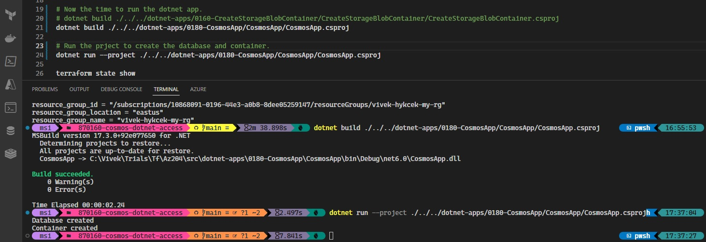

- Ensure the data is populated.

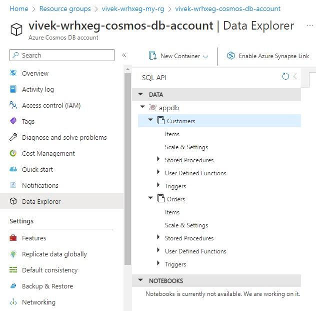


- Now time to create Azure function.

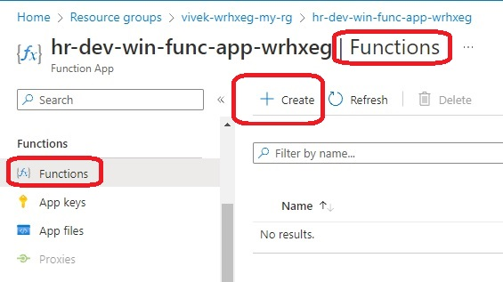

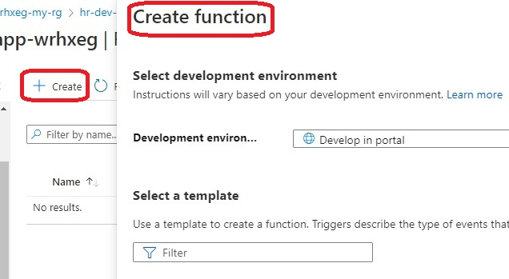

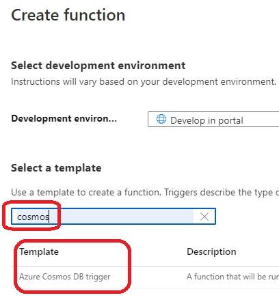


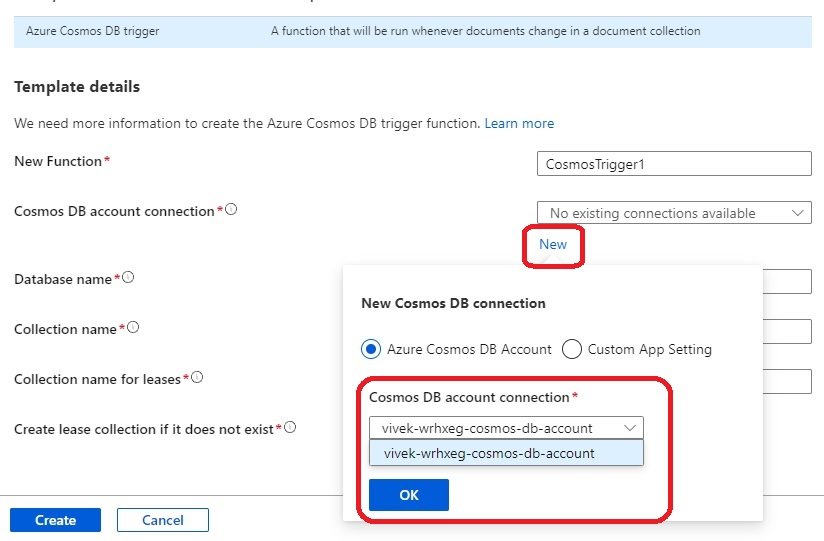

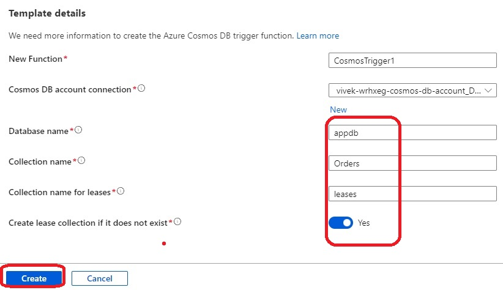

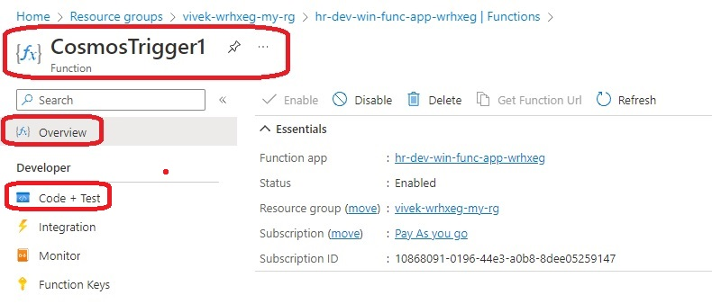

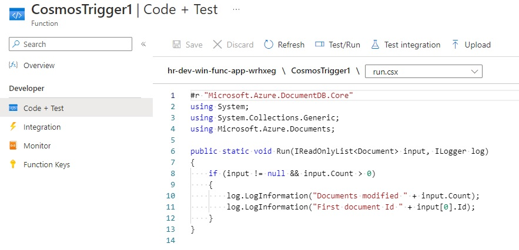

- Now observe that a leases container is also crated.

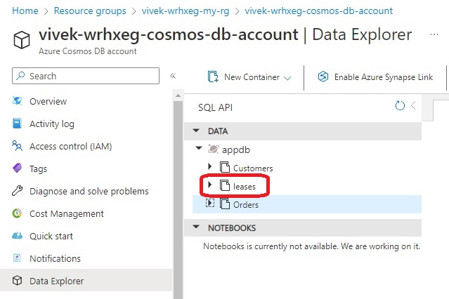
 
- Now add items and observe

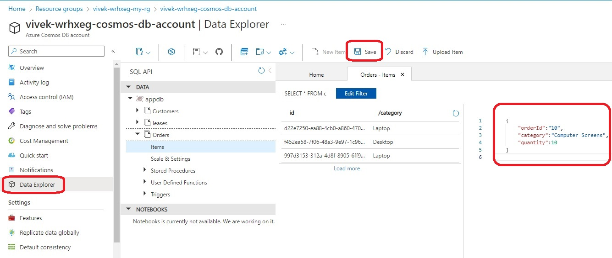

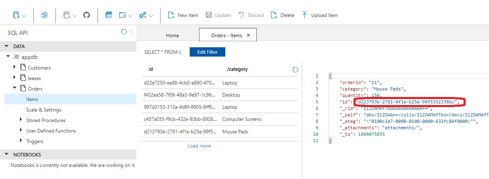

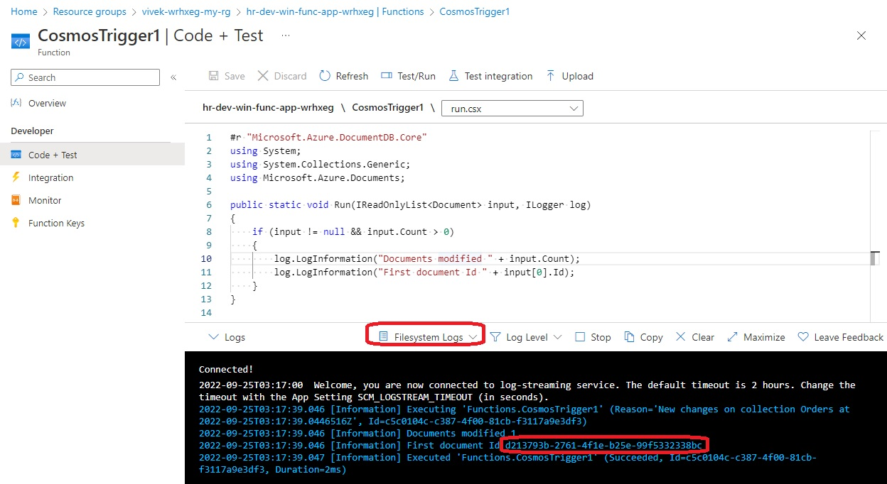

