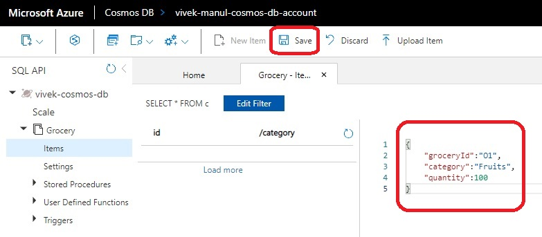

# Table Storage

- The attempt is to create a cosmos db account which is similar to the one created manually.

- We can add a database and container, but not item. 

- So we can add **azurerm_cosmosdb_sql_database** and within that, a container as **azurerm_cosmosdb_sql_container**

- Now to add an item within that container using terraform, there is no way to do that. 

- The [github item here](https://github.com/hashicorp/terraform-provider-azurerm/issues/9023) as on today is still open.

- So we need to add items using other means, such as through portal, or using some apis and calling those apis.

- Add items as follows.

- Use Grocery.json file





- Insure indexing policy 

- Without indexing policy


- With indexing policy


- Run the following. This should work because the compositeIndexes is defined with category and itemName.
SELECT * FROM grocery ORDER BY grocery.category, grocery.itemName


- The following does not work, because category and quantity are not included in the composite indexz

SELECT * FROM grocery ORDER BY grocery.category, grocery.quantity


```js
{
    "indexingMode": "consistent",
    "automatic": true,
    "includedPaths": [
        {
            "path": "/*"
        }
    ],
    "excludedPaths": [
        {
            "path": "/\"_etag\"/?"
        }
    ],
    "compositeIndexes": [
        [
            {
                "path": "/category",
                "order": "ascending"
            },
            {
                "path": "/itemName",
                "order": "ascending"
            }
        ]
    ]
}
```
