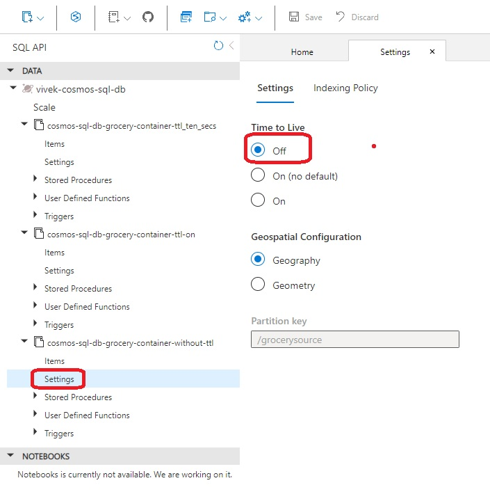

# Composite Index

- Demos Composite Index in Cosmos db

- We can add a database and container, but not item. 

- So we can add **azurerm_cosmosdb_sql_database** and within that, a container as **azurerm_cosmosdb_sql_container**

- Now to add an item within that container using terraform, there is no way to do that. 

- The [github item here](https://github.com/hashicorp/terraform-provider-azurerm/issues/9023) as on today is still open.

- So we need to add items using other means, such as through portal, or using some apis and calling those apis.

- But before that, take a look at settings of the container, that got created due to config.
- Two containers are created, one with ttl and one without ttl. 

- Add items as follows.

- Use Grocery.json file

- Wait for 10 sec and then observe. The item will be removed.

- Wait for 10 sec and then observe. The item will be removed.

- This time, the item will **NOT** be removed. For this container, the ttl is not enabled.
 

