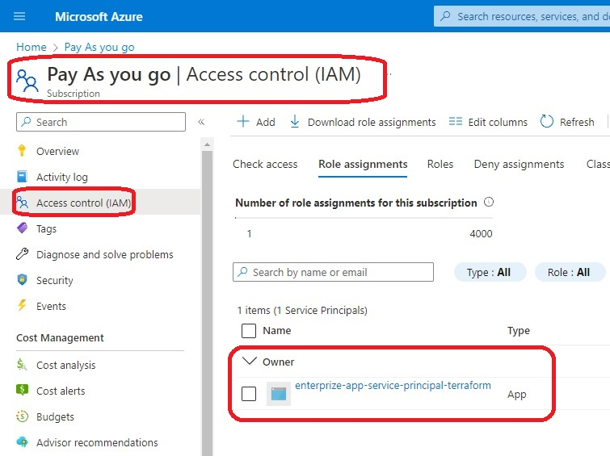
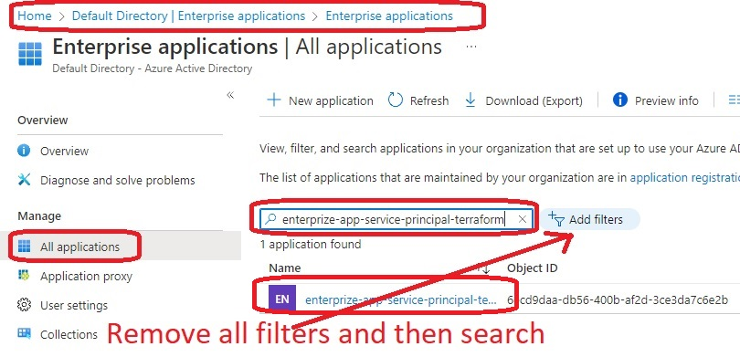

 # Storage Account access using Azure Application Object Service Principal

- This continues from [400380-create-app-and-add-to-subscription-as-owner](https://github.com/AvtsVivek/Az204WthTerraform/tree/main/src/tf-files/400380-create-app-and-add-to-subscription-as-owner)

- Here we are registring an app. Also we are creating a service principal along with this app. 

- The we are assigning a Role of **Owner** to this created Application object/service principal. 
  - The scope for this case being the Storage Account.

- 

- 

