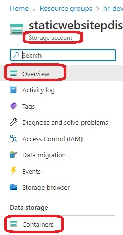
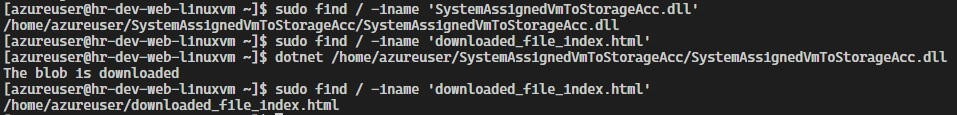

# Create a VM with a network security group

- Objective
  - This app runs on a vm and downloads a file in a container located on a storage account.
  - The vm is configured with a SystemAssigned Managed Service identity.
  - And this identity is assigned the roles of Reader and Storage Blob Data Reader scoped to the storage account.

- Deploy a linux vm. Install dotnet run time. 

- This builds from [630100-simple-web-app-to-linux-vm-ngnx](https://github.com/AvtsVivek/Az204WthTerraform/tree/main/src/tf-files/630100-simple-web-app-to-linux-vm-ngnx)

- Next [810035-acr-docker-vm-system-assigned](https://github.com/AvtsVivek/Az204WthTerraform/tree/main/src/tf-files/810035-acr-docker-vm-system-assigned) shows a system assigned example. Role assignment is picked from there.

- Also finally 


- Once successfully applied, Review the resources.

- Get the blob url from the storage account. It should look somehting like this. See the images.

- var blobURI = "https://staticwebsitepdismj.blob.core.windows.net/content/index.html";

- Then update in the file.
  
    ./../../dotnet-apps/0300-SystemAssignedVmToStorageAcc/Program.cs

- Now build, ensure no errors and publish. 

    dotnet build ./../../dotnet-apps/0300-SystemAssignedVmToStorageAcc/SystemAssignedVmToStorageAcc.csproj

- First ensure the simple web app is published. 
- Run either of the following two comands
- Debug

```
dotnet publish ./../../dotnet-apps/0300-SystemAssignedVmToStorageAcc/SystemAssignedVmToStorageAcc.csproj

dotnet publish ..\..\dotnet-apps\0300-SystemAssignedVmToStorageAcc\SystemAssignedVmToStorageAcc.csproj
```
-c Release

```
dotnet publish -c Release ./../../dotnet-apps/0300-SystemAssignedVmToStorageAcc/SystemAssignedVmToStorageAcc.csproj

dotnet publish -c Release ..\..\dotnet-apps\0300-SystemAssignedVmToStorageAcc\SystemAssignedVmToStorageAcc.csproj
```






