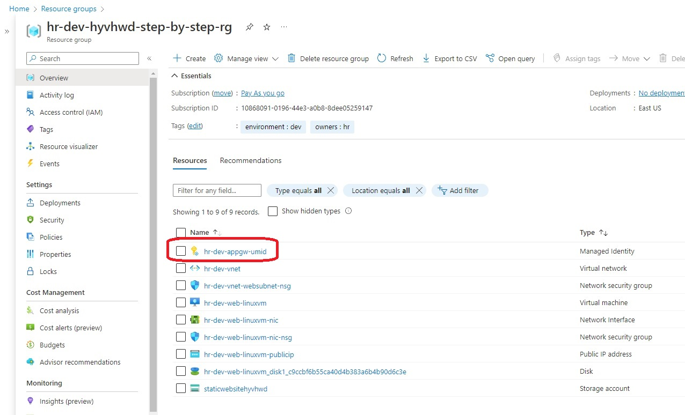
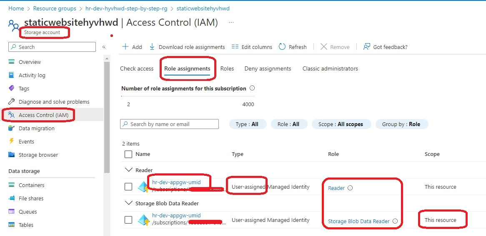
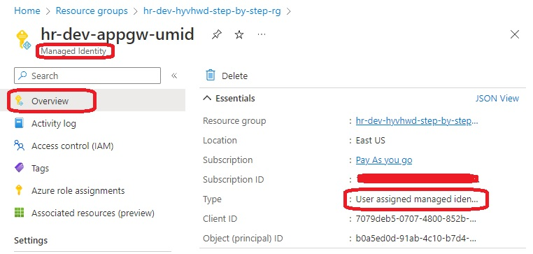
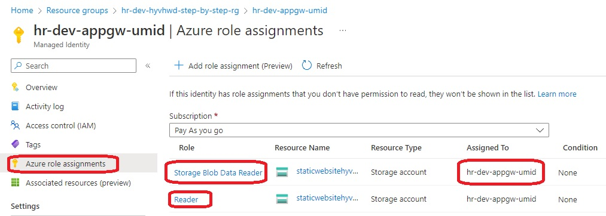
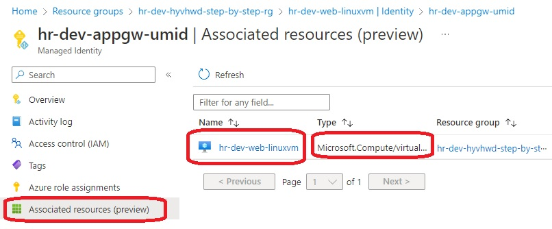
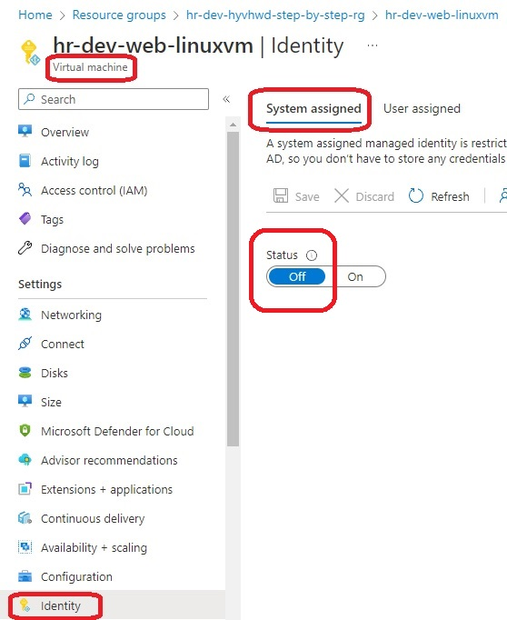
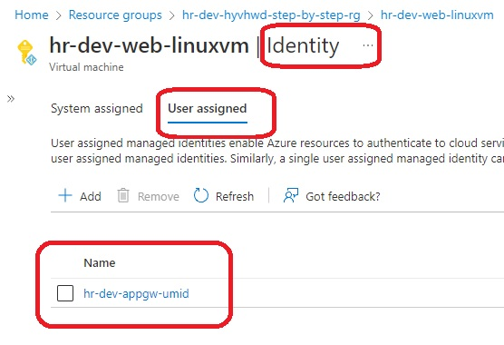

# Create a VM with a network security group

- Objective
  - This app runs on a vm and downloads a file in a container located on a storage account.
  - The vm is configured with a SystemAssigned Managed Service identity.
  - And this identity is assigned the roles of Reader and Storage Blob Data Reader scoped to the storage account.

- Deploy a linux vm. Install dotnet run time. 

- This builds from [890250-linux-vm-system-assigned-managed-id](https://github.com/AvtsVivek/Az204WthTerraform/tree/main/src/tf-files/890250-linux-vm-system-assigned-managed-id). But this example has UserAssigned as againest SystemAssigned.


- What is different? Take a look at the vm resource file. Take a look at the resource azurerm_linux_virtual_machine.web_linuxvm. in the file **tf7-05-web-linuxvm-resource.tf**. And note the follwing. 
  - Its user assigned and not system assigned.

```
  # identity {
  #   type = "SystemAssigned"
  # }

  identity {
    type         = "UserAssigned" #"SystemAssigned"
    identity_ids = [azurerm_user_assigned_identity.appag_umid.id]
  }
```

  - Also take a look at the file **tf11-azurerm-user-assigned-identity.tf**. Look for azurerm_user_assigned_identity resource. Also take a look at the azurerm_role_assignment resource. Now take a look at the images. 

















