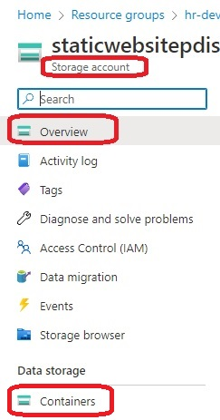
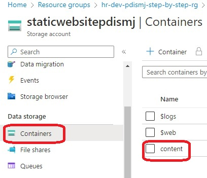
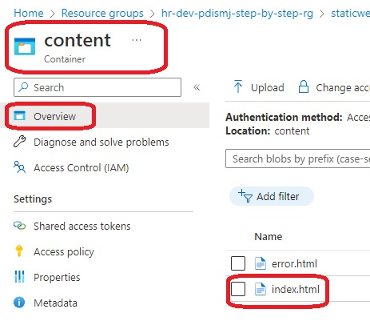
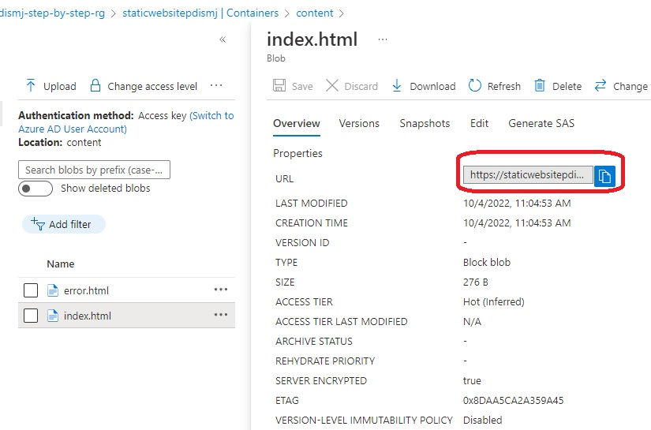
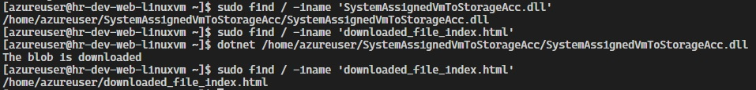

# Create a VM with a network security group

- Objective
  - This app runs on a vm and downloads a file in a container located on a storage account.
  - The vm is configured with a SystemAssigned Managed Service identity.
  - And this identity is assigned the roles of Reader and Storage Blob Data Reader scoped to the storage account.

- Deploy a linux vm. Install dotnet run time. 

- This builds from [890250-linux-vm-system-assigned-managed-id](https://github.com/AvtsVivek/Az204WthTerraform/tree/main/src/tf-files/890250-linux-vm-system-assigned-managed-id). But this example has UserAssigned as againest SystemAssigned.

- Once successfully applied, Review the resources.

- Get the blob url from the storage account. It should look somehting like this. See the images.

- var blobURI = "https://staticwebsitepdismj.blob.core.windows.net/content/index.html";

- Then update in the file.
  
    ./../../dotnet-apps/0300-ManagedIdVmToStorageAcc/Program.cs

- Now build, ensure no errors and publish. 

    dotnet build ./../../dotnet-apps/0300-ManagedIdVmToStorageAcc/ManagedIdVmToStorageAcc.csproj

- First ensure the simple web app is published. 
- Run either of the following two comands
- Debug

```
dotnet publish ./../../dotnet-apps/0300-ManagedIdVmToStorageAcc/ManagedIdVmToStorageAcc.csproj

dotnet publish ..\..\dotnet-apps\0300-ManagedIdVmToStorageAcc\ManagedIdVmToStorageAcc.csproj
```
-c Release

```
dotnet publish -c Release ./../../dotnet-apps/0300-ManagedIdVmToStorageAcc/ManagedIdVmToStorageAcc.csproj

dotnet publish -c Release ..\..\dotnet-apps\0300-ManagedIdVmToStorageAcc\ManagedIdVmToStorageAcc.csproj
```


- Similarly you need to do for the second app as well.













- What is different?

```
  # identity {
  #   type = "SystemAssigned"
  # }

  identity {
    type         = "UserAssigned" #"SystemAssigned"
    identity_ids = [azurerm_user_assigned_identity.appag_umid.id]
  }
```

