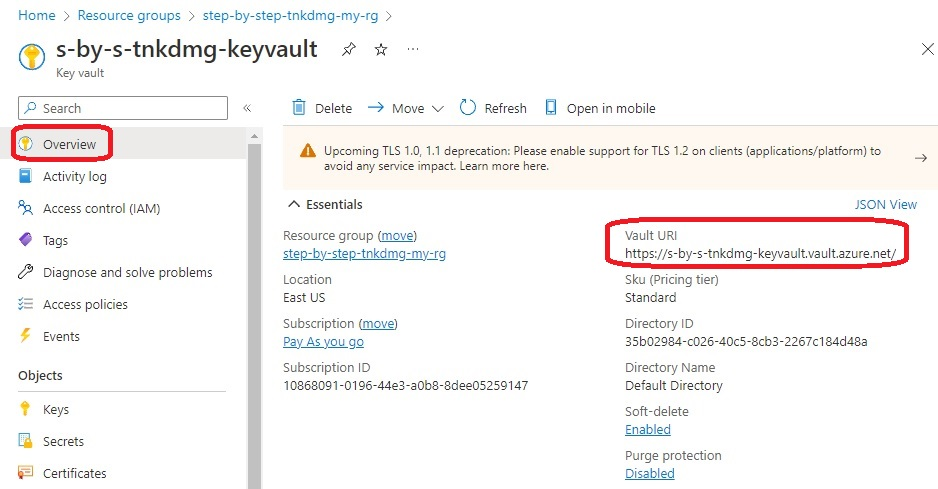

# Azure Key Vault

# WIP

- The objective is to demo an dotnet 6 app accessing a connection string(any secret for that matter) which is present as a secret inside of a Azure Key Vault.

- This example extends a previous example. This example, deploys an Azure Key Vault. And then inside of it a secret. That secret will contain a connection string. 

- This example does not contain any application object. But instead, it has a Windows Web app Service. This Web App Service has SystemAssigned identity. Find the following code in the resource **azurerm_windows_web_app** in file **tf10-2-win-web-app.tf**

```tf
identity {
  type = "SystemAssigned"
}
```

- Also find the following access policy settings in Azure Key Vault. So here the system assigned id from Windows Web App Service is used for the access policy.

```tf
access_policy {
  tenant_id = data.azurerm_client_config.current.tenant_id
  # https://stackoverflow.com/a/73918886/1977871
  # application_id = azuread_application.app.application_id
  object_id = azurerm_windows_web_app.windows_web_app.identity[0].principal_id
  ...
}
```

- Here there is no database. 

- Once the resources are deployed, Review them.





- # Need to update the following variable in the file 

    ./../../dotnet-apps/0350-AzureKeyValutFromWebApiAccess/Controllers\ConnectionController.cs

```tf    
var keyvaultUrl = "https://s-by-s-yuxxwo-keyvault.vault.azure.net/";
```

