# Azure Key Vault example.

- Reference: 
  - https://github.com/Azure/azure-sdk-for-net/blob/main/sdk/identity/Azure.Identity/TROUBLESHOOTING.md#azure-app-service-and-azure-functions-managed-identity

  - https://github.com/Azure/Azure-Functions/issues/2100


# Currently this is not working. Getting the follwiong error.


```
ManagedIdentityCredential authentication failed: Service request failed.
Status: 400 (Bad Request)
```

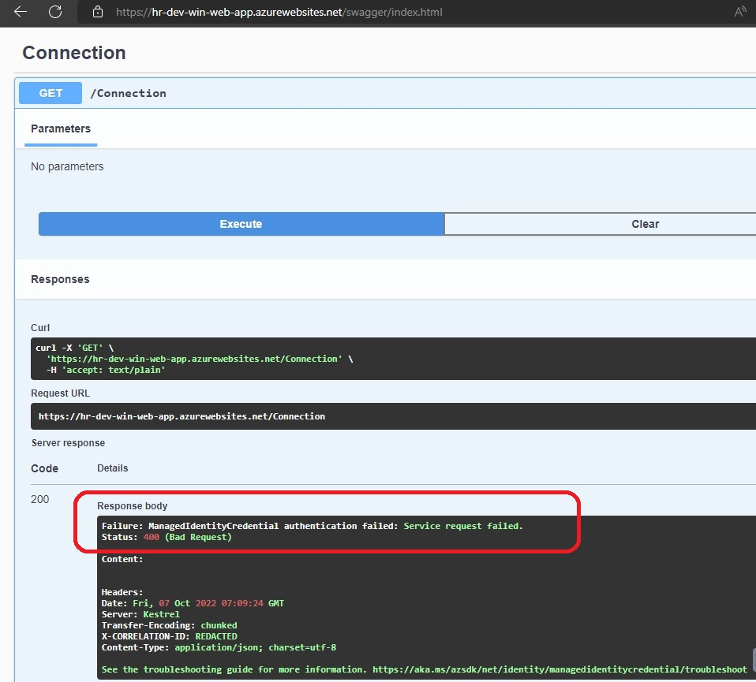

- The objective is to demo an dotnet 6 app accessing a connection string(any secret for that matter) which is present as a secret inside of a Azure Key Vault.

- This example extends a previous example. This example, deploys an Azure Key Vault. And then inside of it a secret. That secret will contain a connection string. 

- This example does not contain any application object. But instead, it has a Windows Web app Service. This Web App Service has UserAssigned identity (in contrast to SystemAssigned identity). Find the following code in the resource **azurerm_windows_web_app** in file **tf10-2-win-web-app.tf**

```tf
  identity {
    type = "UserAssigned"
    # If you use UserAssigned, then identity_ids should not be null
    identity_ids = [azurerm_user_assigned_identity.appag_umid.id]
    # type = "SystemAssigned"
  }
```

- Also find the following access policy settings in Azure Key Vault. So here the system assigned id from Windows Web App Service is used for the access policy.

```tf
access_policy {
    tenant_id = data.azurerm_client_config.current.tenant_id
    object_id = azurerm_user_assigned_identity.appag_umid.principal_id
  ...
}
```

- Here in this example, there is no database.

- Once the resources are deployed, Review them.

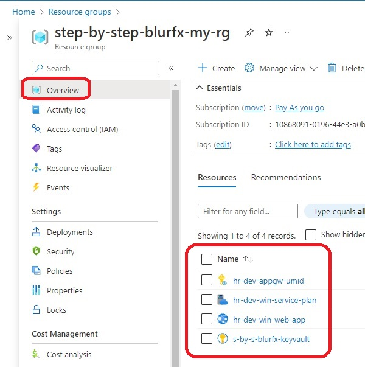

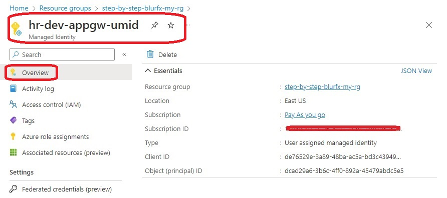

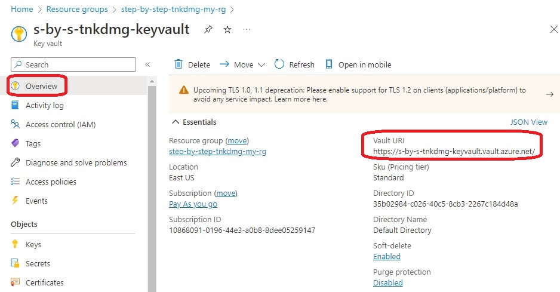

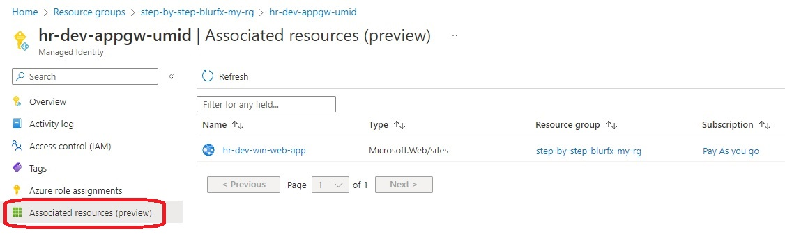

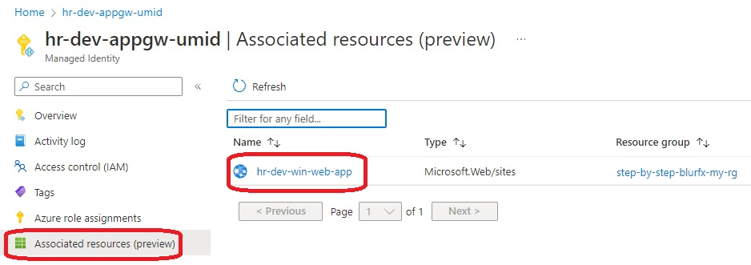

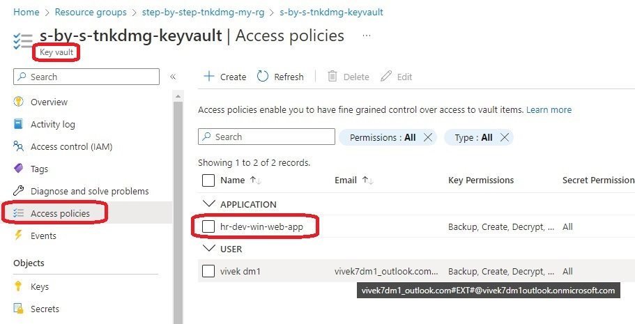

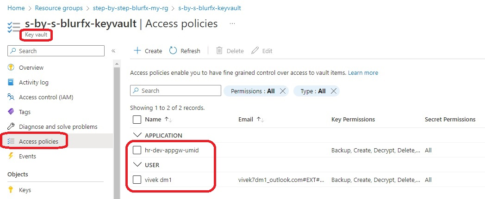

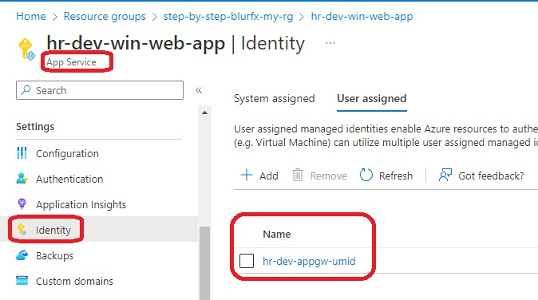

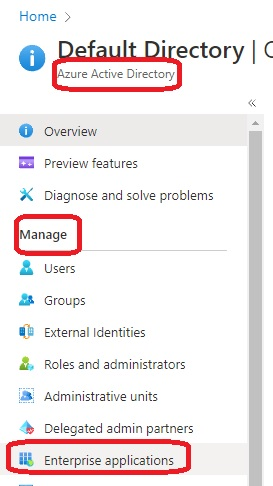

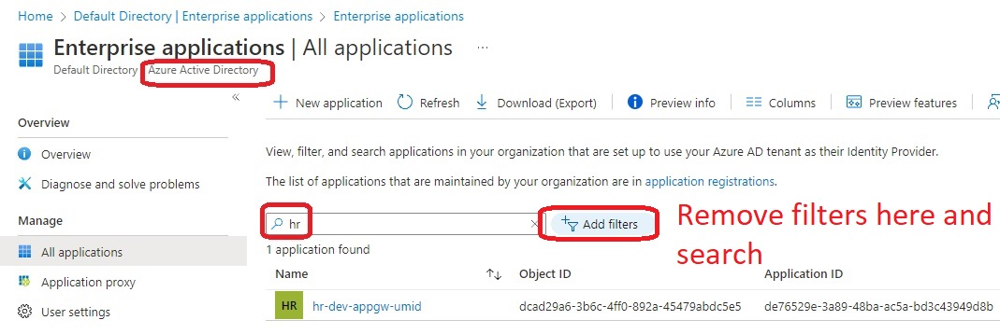

- # Need to update the following variable in the file 

    ./../../dotnet-apps/0350-AzureKeyValutFromWebApiAccess/Controllers\ConnectionController.cs

```tf    
var keyvaultUrl = "https://s-by-s-yuxxwo-keyvault.vault.azure.net/";
```


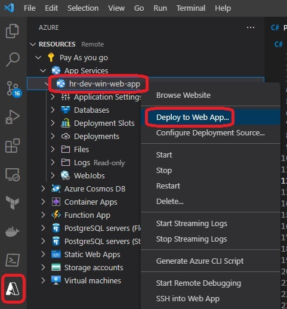

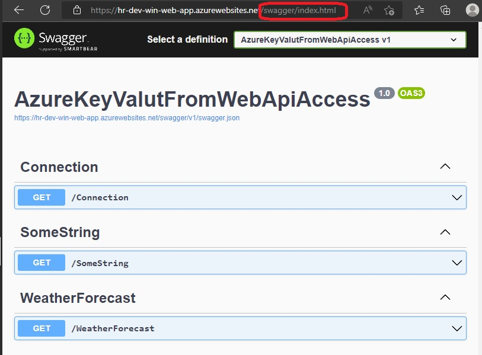

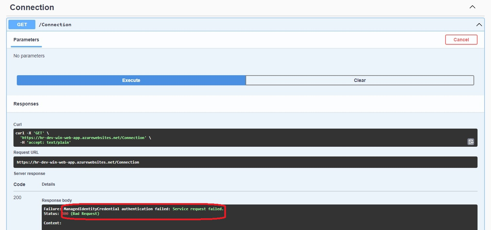

